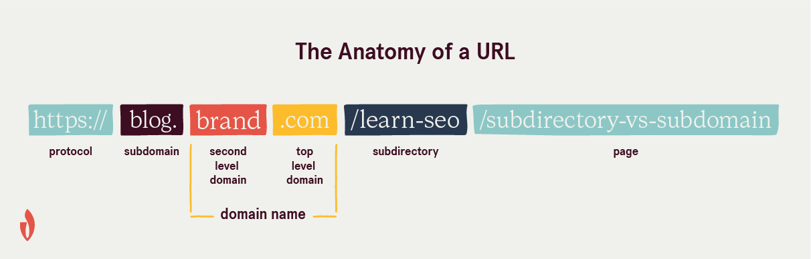

## Anatomy of a URL: Understanding the Building Blocks of Web Addresses

The URL (Uniform Resource Locator) is a fundamental concept in the world of the internet. It serves as the address for any resource accessible through the web, whether it's a website, an image, a video, or any other file. Understanding the anatomy of a URL is crucial for web developers, digital marketers, and anyone curious about how the internet works. In this article, we'll break down the key components of a URL and explore their roles.

### 1. Scheme/Protocol

The scheme, also known as the protocol, is the first part of a URL and indicates the communication protocol used to access the resource. The most common schemes are:

- **HTTP**: Stands for "Hypertext Transfer Protocol," which is used for standard web pages.
- **HTTPS**: Similar to HTTP, but the 'S' stands for "Secure." It encrypts the data transmitted, ensuring a secure connection, commonly used for sensitive information like login credentials and online transactions.
- **FTP**: Stands for "File Transfer Protocol," used for uploading and downloading files to/from a server.
- **mailto**: This scheme is used to create a hyperlink that, when clicked, opens the user's default email client with the specified email address.
- **file**: Points to a file on the local system.

### 2. Domain Name

The domain name is the human-readable address of a website. It's part of the URL that users recognize and remember. For example, in "https://www.example.com," "www.example.com" is the domain name. Domain names consist of multiple parts, separated by dots. The last part is the top-level domain (TLD), representing the type or purpose of the website (.com, .org, .net, .edu, etc.). The rest of the domain is the second-level domain (SLD), which identifies the specific website.

### 3. Subdomain

A subdomain is an optional part of a URL that appears before the domain name and is separated by dots. It can act as a subdivision of the main domain, pointing to a specific section or functionality of the website. For instance, "blog.example.com" and "shop.example.com" are both subdomains of "example.com."

### 4. Port

The port number is an optional element of a URL, typically used to specify the network port to which the client should connect when making the request. If no port is specified, the default port for the given scheme is used (e.g., port 80 for HTTP and port 443 for HTTPS).

### 5. Path

The path is a crucial part of a URL that identifies the specific resource's location on the server. It follows the domain name and is separated by slashes (/). The path can consist of directories, subdirectories, and filenames. For example, in "https://www.example.com/blog/article.html," "/blog/article.html" is the path.

### 6. Query Parameters

Query parameters appear after the path and are used to pass data to the web server. They are separated from the path using a question mark (?), and multiple parameters are separated by ampersands (&). Query parameters are key-value pairs, where the key represents the parameter name, and the value is the data associated with it. For example, in "https://www.example.com/search?q=URL+anatomy," "?q=URL+anatomy" is the query parameter, with "q" as the key and "URL anatomy" as the value.

### 7. Fragment Identifier

The fragment identifier, also known as the anchor, is an optional part of a URL that appears after the hash symbol (#). It points to a specific section within the web page. When the URL is accessed, the browser will scroll to the section identified by the fragment identifier. It is particularly useful for linking to specific content on long web pages.

Now that you understand the anatomy of a URL, you can use this knowledge to navigate the web effectively, troubleshoot broken links, and even build websites with better URL structures. Remember, URLs are the backbone of the internet, and having a solid grasp of their components is essential for any digital enthusiast. Happy surfing!