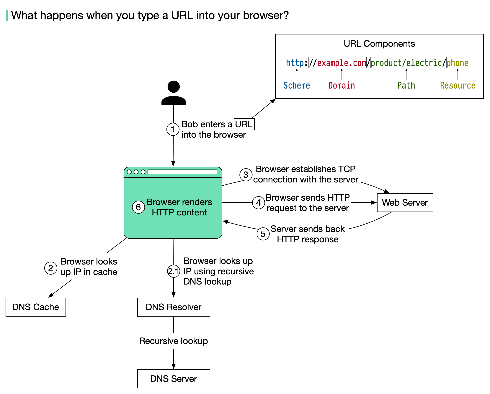

**Exploring the Journey of a URL: How Web Pages Come to Life**

In the digital realm, when Bob enters a URL into his browser and presses Enter, a fascinating journey begins. Let's explore the steps behind this process using a simple numbering system:


**Step 1:** Bob enters the URL into the browser, consisting of four parts:
- 🔹 Scheme: "http://". This instructs the browser to communicate with the server using HTTP.
- 🔹 Domain: "example.com". It's the domain name of the website.
- 🔹 Path: "product/electric". This represents the server's path to the desired resource: "phone".
- 🔹 Resource: "phone". The name of the resource Bob wants to visit.

**Step 2:** The browser looks up the IP address for the domain through a Domain Name System (DNS) lookup. To speed up this process, data is cached at various levels: browser cache, OS cache, local network cache, and ISP cache.

**Step 2.1:** If the IP address isn't found in any cache, the browser performs a recursive DNS lookup, reaching out to DNS servers until the IP address is obtained (covered in a separate post).

**Step 3:** Now that the browser has the server's IP address, it establishes a TCP connection with the server.

**Step 4:** The browser sends an HTTP request to the server. The request might look like this:

```
GET /phone HTTP/1.1
Host: example.com
```

**Step 5:** The server processes the request and sends back the response. For a successful response (status code 200), the HTML response might look like this:
```
HTTP/1.1 200 OK
Date: Sun, 30 Jan 2022 00:01:01 GMT
Server: Apache
Content-Type: text/html; charset=utf-8

<!DOCTYPE html>
<html lang="en">
<head>
<title>Hello world</title>
</head>
```

**Step 6:** The browser renders the HTML content received from the server, displaying the webpage with its content and structure.

And there you have it! The steps behind the scenes when you enter a URL into your browser.