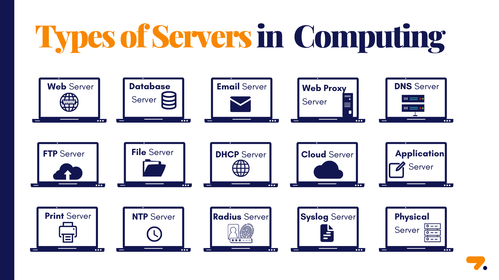

**Different Types of Hosting in Web Development**

In web development, hosting refers to the service of storing and making websites accessible on the internet. There are various types of hosting available, each catering to different needs and requirements. Let's explore each type and understand where and when to use them:

 

**1. Shared Hosting:**
- Shared hosting is like sharing an apartment with roommates. Multiple websites share the same server resources, such as storage, memory, and processing power.
- Use Shared Hosting When: You have a small website with low traffic or are just starting with web development on a budget.

Examples:
  - Bluehost (https://www.bluehost.com/)
  - HostGator (https://www.hostgator.com/)
  - SiteGround (https://www.siteground.com/)

**2. VPS Hosting (Virtual Private Server):**
- VPS hosting is like renting a private room in a shared house. It offers more resources and flexibility than shared hosting, as you get a virtual server dedicated to your website.
- Use VPS Hosting When: Your website traffic is increasing, and you need better performance and control over server settings.

Examples:
  - DigitalOcean (https://www.digitalocean.com/)
  - Linode (https://www.linode.com/)
  - Vultr (https://www.vultr.com/)

**3. Dedicated Hosting:**
- Dedicated hosting is like owning a standalone house. You get an entire physical server dedicated solely to your website, offering the highest level of performance and customization.
- Use Dedicated Hosting When: You have a large, resource-intensive website with high traffic, or you need complete control over server configurations.

Examples:
  - Liquid Web (https://www.liquidweb.com/)
  - InMotion Hosting (https://www.inmotionhosting.com/)
  - Hostwinds (https://www.hostwinds.com/)

**4. Cloud Hosting:**
- Cloud hosting is like living in a flexible apartment building. It uses multiple interconnected servers to provide scalability and reliability.
- Use Cloud Hosting When: You want to handle varying traffic levels effectively, as cloud hosting can dynamically scale resources up or down.

Examples:
  - Amazon Web Services (AWS) (https://aws.amazon.com/)
  - Google Cloud Platform (https://cloud.google.com/)
  - Microsoft Azure (https://azure.microsoft.com/)

**5. Managed WordPress Hosting:**
- Managed WordPress hosting is like having a maintenance team for your WordPress website. The hosting provider takes care of updates, backups, and security.
- Use Managed WordPress Hosting When: You run a WordPress site and want to focus on content creation without dealing with technical aspects.

Examples:
  - WP Engine (https://wpengine.com/)
  - Flywheel (https://getflywheel.com/)
  - Kinsta (https://kinsta.com/)

**6. Reseller Hosting:**
- Reseller hosting is like being a middleman. You purchase hosting resources in bulk from a provider and sell smaller hosting plans to others.
- Use Reseller Hosting When: You want to start your web hosting business or manage multiple websites for clients.

Examples:
  - HostPapa (https://www.hostpapa.com/)
  - A2 Hosting (https://www.a2hosting.com/)
  - HostGator Reseller Hosting (https://www.hostgator.com/reseller-hosting)

**Summary:**
Choosing the right type of hosting for your website depends on your website's size, traffic, and specific needs. Each type of hosting offers different levels of performance, scalability, and management, allowing you to find the perfect fit for your web development project. Whether you're a beginner, a growing business, or a seasoned developer, there's a hosting solution suitable for you.