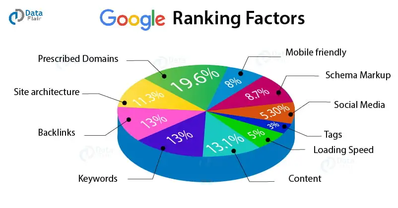

**Introduction to Search Engines:**

In web development, search engines play a crucial role in helping users find relevant information on the internet. A search engine is a powerful tool that indexes and catalogs websites, allowing users to search for specific topics, products, or services. Understanding how search engines work and utilizing SEO tools is essential for web developers to optimize websites for better visibility and user engagement.

**How Search Engines Work:**

1. **Crawling:** Search engines use programs called crawlers or bots to browse the internet and discover new web pages. These crawlers follow links from one page to another, creating a vast index of websites.

2. **Indexing:** Once the crawlers gather information from various websites, the search engine indexes the content. This process involves analyzing the webpage's text, keywords, images, and other elements to understand its relevance to specific search queries.

3. **Ranking:** When a user enters a search query, the search engine uses complex algorithms to determine the most relevant results. The ranking process considers factors like keywords, website authority, user engagement, and relevance to deliver the best possible results.

4. **Displaying Results:** The search engine then displays the search results in a list, with the most relevant websites appearing at the top. Users can click on the links to access the websites and find the information they are looking for.

**Examples of Different Search Engines:**

1. **Google:** The most popular and widely used search engine globally, known for its accurate and extensive search results.

2. **Bing:** Microsoft's search engine, offering similar functionalities to Google and powering searches on Bing.com and Yahoo.com.

3. **Yahoo:** While Yahoo is primarily known for its web portal, it also operates its search engine, providing relevant search results.

4. **DuckDuckGo:** A privacy-focused search engine that does not track user data, offering anonymous search capabilities.

**SEO Measurement Tools:**

1. **Google Webmaster Tools (Google Search Console):** This tool provides insights into how Google sees and indexes your website. It offers valuable data on search queries, website performance, and any issues that may affect your site's visibility on Google.

2. **Bing Webmaster Tools:** Similar to Google Webmaster Tools, this tool helps website owners monitor their website's performance on Bing's search engine.

**Simple Use Case: Implementing SEO for a Blog:**

 
**When to Use:**
Suppose you are a web developer working on a blog website. You want to improve the blog's visibility on search engines, attract more readers, and increase organic traffic. This is where SEO and search engine measurement tools come into play.

**Steps to Follow:**

1. **Keyword Research:** Use keyword research tools to find relevant and popular keywords related to the blog's content.

2. **Optimize Content:** Incorporate the selected keywords naturally into the blog posts' titles, headings, and content. Ensure the blog's content is informative, engaging, and valuable to readers.

3. **Meta Tags and Descriptions:** Create compelling meta tags and descriptions for each blog post, as these elements appear in search engine results and can influence click-through rates.

4. **Submit Sitemap:** Submit the blog's sitemap to Google and Bing Webmaster Tools to ensure search engines can crawl and index the pages efficiently.

5. **Measure and Analyze:** Use Google Webmaster Tools and Bing Webmaster Tools to monitor the blog's performance, track search queries, and identify any issues that need attention.

**Summary:**

Search engines are essential tools in web development, helping users discover relevant information online. By understanding how search engines work and leveraging SEO techniques and measurement tools, web developers can optimize websites for better search engine visibility, user engagement, and overall online success.