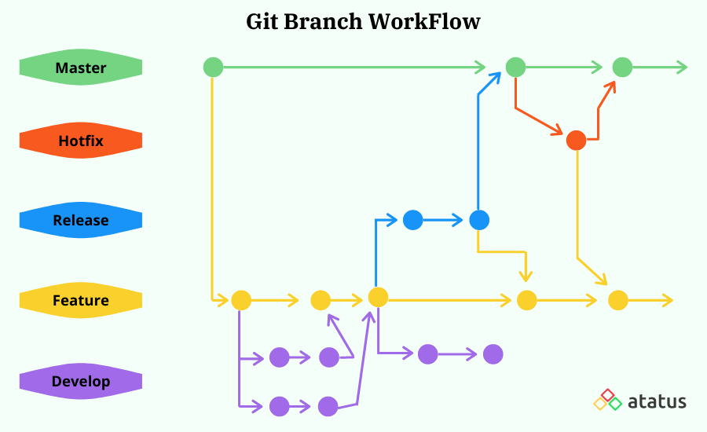

**Introduction to Git Branching and Merging:**

Git branching and merging are powerful features that allow developers to work on multiple versions of a codebase simultaneously and later combine them seamlessly. Branches in Git represent different lines of development, and merging brings these branches together to incorporate the changes. This documentation will explain the basics of branching and merging in simple words, cover different Git branching strategies, and explore use cases for branching on GitHub.

 

**Git Branching Basics:**

- **Branch:** A branch is a separate line of development that allows you to work on a feature or bug fix without affecting the main codebase (usually known as the "master" branch or "main" branch).

- **Creating a Branch:** To create a new branch, use the command: `git branch <branch-name>`. This command creates the branch but doesn't switch to it.

- **Switching to a Branch:** To switch to the new branch, use the command: `git checkout <branch-name>`. This command allows you to start working on the new branch.

- **Creating and Switching to a Branch (Shortcut):** Use the command: `git checkout -b <branch-name>` to create and switch to a new branch in one step.

**Git Merging Basics:**

 

- **Merging:** Merging combines the changes from one branch into another. It allows you to incorporate the work done in a feature branch back into the main codebase.

- **Merging Local Branches:** To merge one branch into another, switch to the target branch (`git checkout <target-branch>`) and then use the command: `git merge <source-branch>`.

- **Fast-Forward Merge:** If the target branch's history has not diverged since the creation of the source branch, a fast-forward merge occurs, and the changes are incorporated smoothly.

- **Merge Commit:** If there are conflicting changes between the branches, a merge commit is created, and you need to resolve the conflicts manually.

**Different Git Branching Strategies:**

1. **Feature Branching:**
   - Create a branch for each new feature or enhancement.
   - Isolate changes related to specific features.
   - Merge the feature branch back to the main branch when the feature is complete.

2. **Gitflow Workflow:**
   - Based on the "master" and "develop" branches.
   - New features are developed in feature branches off "develop."
   - Once a release is ready, it is merged into "master," and a "release" branch is created.

3. **GitHub Flow:**
   - Simple workflow for small teams or frequent deployments.
   - Development is primarily done in the main branch.
   - Feature branches are created when needed and merged back to the main branch.

**Use Case: GitHub Branching for Bug Fix:**

Suppose you are working on an open-source project hosted on GitHub, and you want to fix a bug. Here's how you can use branching:

1. **Create a Branch:** Clone the repository and create a new branch named "bug-fix" using `git checkout -b bug-fix`.

2. **Fix the Bug:** Make the necessary code changes to fix the bug in your "bug-fix" branch.

3. **Commit and Push:** Commit the changes (`git commit -m "Fixed bug"`) and push the branch to GitHub (`git push origin bug-fix`).

4. **Pull Request:** Go to the GitHub repository page, click on "Compare & pull request" for the "bug-fix" branch, add a description, and click "Create pull request."

5. **Review and Merge:** Project maintainers can review your code changes, and if approved, they will merge your "bug-fix" branch into the main branch, incorporating your changes into the project.

**Summary:**

Git branching and merging are essential for effective code management in software development. By creating branches for specific features or bug fixes and merging them back into the main codebase, developers can work collaboratively and maintain a clean and organized code history. Understanding different branching strategies allows teams to choose the workflow that best suits their development needs and project requirements.