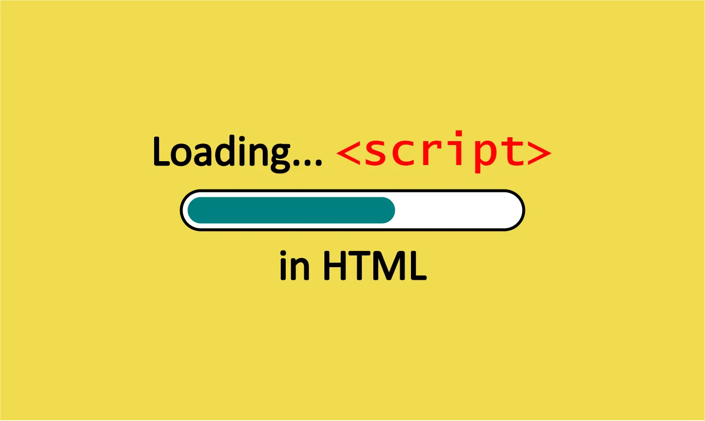
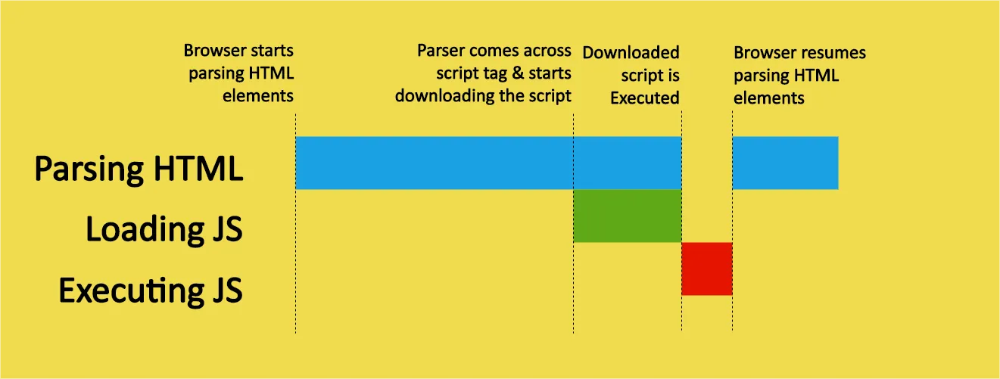
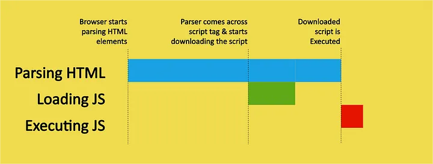

**HTML Head Script Execution with Async and Defer**

**Introduction:**

In HTML, when you include JavaScript code within the `<head>` element, it can impact the loading and rendering of the webpage. The traditional way of including scripts can lead to slower page loading and may block other resources from loading. To improve script execution and page performance, HTML provides two attributes: `async` and `defer`. In this tutorial documentation, we will explore the differences between `async` and `defer`, along with working examples to understand their execution behavior.

**Understanding Async and Defer:**

When a web browser encounters a script in the `<head>` element, it typically halts the HTML parsing process to fetch and execute the script. This behavior can cause delays in rendering the page content and may adversely affect the user experience. To mitigate this issue, the `async` and `defer` attributes allow scripts to load asynchronously, allowing the HTML parsing process to continue, leading to faster page rendering.


 

**Async Attribute:**

The `async` attribute tells the browser to download the script asynchronously while continuing to parse the HTML document. Once the script is downloaded, it is executed immediately, regardless of whether the HTML parsing is complete or not. This means that the script may execute before the entire webpage is loaded, which can impact the order of script execution.
 

**Defer Attribute:**

The `defer` attribute also downloads the script asynchronously, but it ensures that the script is executed only after the entire HTML document is parsed and loaded. This ensures that the scripts maintain their original order of appearance in the HTML file and guarantees that they won't interfere with the page rendering process.

 
**Working Example:**

Let's consider a simple example to demonstrate the differences between `async` and `defer` attributes. We'll create an HTML page with three JavaScript files and include them using both `async` and `defer` attributes.

```html
<!DOCTYPE html>
<html>
<head>
  <title>Async and Defer Example</title>

  <!-- Load script1.js asynchronously using the async attribute -->
  <script async src="script1.js"></script>

  <!-- Load script2.js asynchronously using the defer attribute -->
  <script defer src="script2.js"></script>

  <!-- Load script3.js synchronously (traditional way) -->
  <script src="script3.js"></script>
</head>
<body>
  <h1>Script Execution with Async and Defer</h1>
  <p>This is a demonstration of async and defer attributes for script loading.</p>
</body>
</html>
```

**Script Files:**

Let's create three JavaScript files: `script1.js`, `script2.js`, and `script3.js`. Each file will contain a simple `console.log` statement to identify its execution.

**script1.js**:
```javascript
console.log("Script 1 executed.");
```

**script2.js**:
```javascript
console.log("Script 2 executed.");
```

**script3.js**:
```javascript
console.log("Script 3 executed.");
```

**Execution Behavior:**

1. `async` Attribute:
   - The browser downloads `script1.js` asynchronously while continuing to parse the HTML.
   - When the download is complete, `script1.js` is executed immediately, regardless of the HTML parsing status.
   - Output (console log order may vary):
     ```
     Script 1 executed.
     ```

2. `defer` Attribute:
   - The browser downloads `script2.js` asynchronously while continuing to parse the HTML.
   - The download and execution of `script2.js` are deferred until after the HTML parsing is complete.
   - Output (console log order is guaranteed):
     ```
     Script 2 executed.
     ```

3. Synchronous (Traditional):
   - The browser encounters `script3.js` and halts the HTML parsing process.
   - It downloads and executes `script3.js` before resuming the HTML parsing.
   - Output (console log order may vary):
     ```
     Script 3 executed.
     ```

| Use Case | `async` | `defer` |
|----------|---------|---------|
| Non-Critical Scripts | Load asynchronously, does not block HTML parsing. Suitable for tracking scripts, widgets. | Not suitable, may still block HTML parsing until the entire script is fetched and executed. |
| Scripts with Dependencies | Not suitable, may execute before other scripts or the DOM is ready. | Load asynchronously, but execute after the entire HTML is parsed, maintaining script order and ensuring dependencies are available. |
| Performance Optimization | Load asynchronously, improves initial page load speed. | Not suitable, may still block initial rendering, affecting page load speed. |
| Large Scripts | Not suitable, may still block HTML parsing until the entire script is fetched and executed. | Load asynchronously, allows HTML parsing to continue while script downloads, faster perceived loading times. |
| Third-Party Integrations | Load asynchronously, prevents external services from delaying page load. | Not suitable, may still block HTML parsing until the entire script is fetched and executed. |

Choose `async` for non-critical scripts and performance optimization. Choose `defer` for scripts with dependencies or large scripts to maintain execution order and improve perceived loading times. Always test the behavior of your scripts to ensure they work as intended.

**Summary:**

Using the `async` and `defer` attributes for script loading in the `<head>` element can significantly improve page loading performance. Understanding the differences between `async` and `defer` helps you optimize the execution of JavaScript code and ensures a better user experience. Consider using `async` for non-dependent scripts and `defer` for scripts that depend on the page's content. Always test and observe the behavior of your scripts to achieve the desired results in your web applications. Happy coding!

**Additional Resources:**

For further exploration of the `async` and `defer` attributes, check out these resources:

1. Optimization in HTML: https://www.section.io/engineering-education/understanding-script-tag-attributes-async-defer/
2. W3Schools - JavaScript `async` and `defer`: https://www.w3schools.com/tags/att_script_async.asp