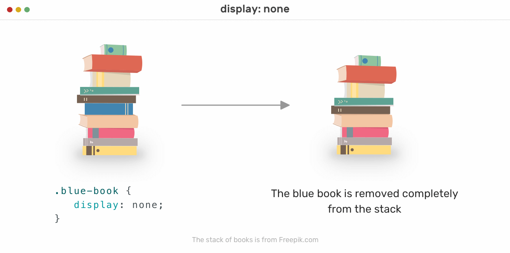

# CSS Display and Visibility Tutorial

## Introduction to CSS Display and Visibility

CSS Display and Visibility properties are used to control the visibility and layout behavior of elements on a web page. They enable you to show or hide elements and alter their display characteristics to create responsive and flexible layouts.



## CSS Display Property

The `display` property is used to control how an element is rendered on the web page. It determines the layout behavior of elements, affecting their positioning and interaction with other elements.

### 1. display: block

**Description:** This value makes the element a block-level element, occupying the full width of its parent container.

**Example:**
```
div {
    display: block;
}
```

In this example, the `<div>` element will behave as a block-level element, taking up the full available width.

### 2. display: inline

**Description:** This value makes the element an inline-level element, occupying only the necessary width to wrap its content.

**Example:**
```
span {
    display: inline;
}
```

In this example, the `<span>` element will behave as an inline-level element, taking up only the width required by its content.

### 3. display: inline-block

**Description:** This value combines aspects of both block and inline elements. It allows the element to have a width and height while flowing inline with other elements.

**Example:**
```
button {
    display: inline-block;
}
```

In this example, the `<button>` element will behave as an inline-block element, having a specific width and height, yet remaining in the flow of other elements.

### 4. display: none

**Description:** This value hides the element entirely, making it invisible and not taking up any space in the layout.

**Example:**
```
header {
    display: none;
}
```

In this example, the `<header>` element will be hidden from the display, and it will not affect the layout.

## CSS Visibility Property

The `visibility` property is used to control the visibility of an element, but it does not affect the layout or positioning of other elements on the page.

### 1. visibility: visible

**Description:** This value makes the element visible.

**Example:**
```
img {
    visibility: visible;
}
```

In this example, the `` element will be visible on the web page.

### 2. visibility: hidden

**Description:** This value hides the element but leaves an empty space where it would have been displayed.

**Example:**
```
aside {
    visibility: hidden;
}
```

In this example, the `<aside>` element will be hidden, but its space will still be reserved in the layout.

## 3 Main Differences between Display and Visibility

| Property       | Affects Layout | Interaction with Other Elements | Element Space |
|----------------|----------------|---------------------------------|---------------|
| display: none  | No            | No                              | No            |
| visibility: hidden | Yes         | No                              | Yes           |
| visibility: visible | Yes         | Yes                             | Yes           |

**1. Affects Layout:** The `display: none` property completely removes the element from the layout, not affecting the space or position of other elements. On the other hand, `visibility: hidden` hides the element while preserving its space in the layout, affecting the position of other elements around it.

**2. Interaction with Other Elements:** The `display: none` property prevents the element from interacting with other elements on the page, as if it doesn't exist. However, `visibility: hidden` still allows the element to interact with other elements, even though it is not visible.

**3. Element Space:** `display: none` removes the element's space from the layout, so there will be no empty space where the element was located. On the contrary, `visibility: hidden` keeps the element's space in the layout, leaving an empty space where the element would have been displayed.

## Example Usage
 Below is an HTML code snippet that demonstrates CSS display and visibility properties, with comments explaining each property:

```html
<!DOCTYPE html>
<html lang="en">
<head>
    <meta charset="UTF-8">
    <meta name="viewport" content="width=device-width, initial-scale=1.0">
    <title>CSS Display and Visibility Properties</title>
    <style>
        /* Add some basic styles for demonstration purposes */
        body {
            font-family: Arial, sans-serif;
            margin: 0;
            padding: 0;
        }
        .box {
            border: 2px solid #333;
            margin: 20px;
            padding: 20px;
        }
        .display-none {
            display: none; /* Hide the element and remove it from the layout */
        }
        .visibility-hidden {
            visibility: hidden; /* Hide the element but keep its space in the layout */
        }
    </style>
</head>
<body>
    <!-- Demonstrating CSS Display and Visibility Properties -->

    <!-- Display: Block (Default) -->
    <div class="box">
        <h3>Display: Block (Default)</h3>
        <p>This is a block-level element. It takes up the full width of its parent.</p>
    </div>

    <!-- Display: Inline -->
    <div class="box" style="display: inline;">
        <h3>Display: Inline</h3>
        <p>This is an inline element. It only takes up the necessary width to display its content.</p>
    </div>

    <!-- Display: Inline-Block -->
    <div class="box" style="display: inline-block;">
        <h3>Display: Inline-Block</h3>
        <p>This is an inline-block element. It behaves like an inline element, but you can set its width and height.</p>
    </div>

    <!-- Display: None -->
    <div class="box display-none">
        <h3>Display: None</h3>
        <p>This element is hidden using "display: none". It is removed from the layout and is not visible.</p>
    </div>

    <!-- Display: Flex -->
    <div class="box" style="display: flex;">
        <h3>Display: Flex</h3>
        <p>This is a flex container. Its child elements can be flex items that can be flexed as rows or columns.</p>
    </div>

    <!-- Display: Grid -->
    <div class="box" style="display: grid;">
        <h3>Display: Grid</h3>
        <p>This is a grid container. Its child elements can be grid items that can be positioned in a grid layout.</p>
    </div>

    <!-- Display: Inline-Flex -->
    <div class="box" style="display: inline-flex;">
        <h3>Display: Inline-Flex</h3>
        <p>This is an inline-flex container. It behaves like an inline element with flex properties.</p>
    </div>

    <!-- Visibility: Visible (Default) -->
    <div class="box">
        <h3>Visibility: Visible (Default)</h3>
        <p>This element is visible by default. It takes up space in the layout and is visible.</p>
    </div>

    <!-- Visibility: Hidden -->
    <div class="box visibility-hidden">
        <h3>Visibility: Hidden</h3>
        <p>This element is hidden using "visibility: hidden". It is not visible, but it keeps its space in the layout.</p>
    </div>

</body>
</html>
```

Explanation:
- The `box` class sets some basic styles for the demonstration purposes, including border, margin, and padding.
- The `display-none` class applies `display: none` to hide the element.
- The `visibility-hidden` class applies `visibility: hidden` to hide the element while keeping its space in the layout.

When you run this HTML code, you will see each box demonstrating different CSS display and visibility properties, making it easier to understand how they affect the visibility and layout of elements on a web page.
## Summary

CSS Display and Visibility properties allow you to control the layout and visibility of elements on your web page. By using `display: block`, `display: inline`, `display: inline-block`, `display: none`, `visibility: hidden`, and `visibility: visible`, you can customize the appearance and behavior of elements based on your design requirements.

## Additional Resources

1. [MDN Web Docs - CSS display](https://developer.mozilla.org/en-US/docs/Web/CSS/display): This resource from MDN provides detailed explanations and examples of the CSS Display property.

2. [W3Schools - CSS visibility](https://www.w3schools.com/cssref/pr_class_visibility.asp): W3Schools offers a comprehensive guide on the CSS Visibility property, along with interactive examples and exercises to practice your understanding.