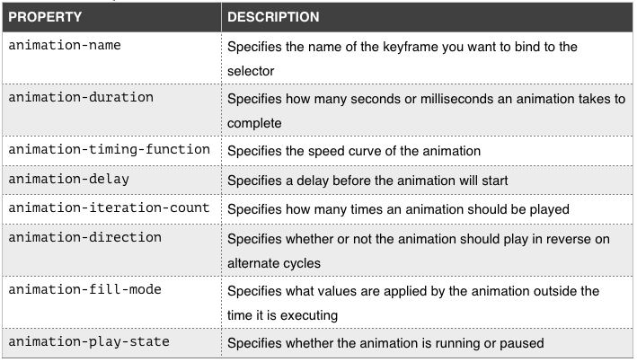
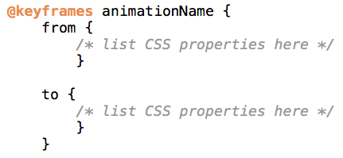

# CSS Keyframes Tutorial

## Introduction to CSS Keyframes

CSS Keyframes are used in animations to define a sequence of styles that create smooth and dynamic transitions between different states of an element. With keyframes, you can specify the intermediate steps of an animation and control the timing and duration of each step. In this tutorial, we will explore the basics of CSS Keyframes and how to implement them in your web designs.

## Understanding CSS Keyframes

CSS Keyframes are used in conjunction with animations. They allow you to define the stages or key points of an animation, and then you apply those keyframes to an element to create the animation effect. Keyframes are defined using the `@keyframes` rule, which contains CSS rules to be applied at specific percentages of the animation duration.



## Types of CSS Keyframes

There are different types of CSS Keyframes to define various animations:

### 1. Basic Animation

**Demo:**
```css
@keyframes fadeInOut {
    0% {
        opacity: 0;
    }
    50% {
        opacity: 1;
    }
    100% {
        opacity: 0;
    }
}
```

**Explanation:**
In this example, the `fadeInOut` keyframes define a basic fade-in and fade-out animation. The element starts with an opacity of 0 at 0% of the animation, becomes fully opaque at 50%, and then fades back to an opacity of 0 at 100%.

### 2. Sliding Animation

**Demo:**
```css
@keyframes slideInOut {
    0% {
        transform: translateX(-100px);
    }
    50% {
        transform: translateX(0);
    }
    100% {
        transform: translateX(-100px);
    }
}
```

**Explanation:**
In this example, the `slideInOut` keyframes define a sliding animation. The element starts 100 pixels to the left of its original position at 0% of the animation, slides back to its original position at 50%, and then slides back 100 pixels to the left at 100%.

## Applying Keyframes to an Element

To apply keyframes to an element, use the `animation` property.

**Demo:**
```css
.element {
    animation: fadeInOut 2s infinite;
}
```

**Explanation:**
In this example, the `fadeInOut` keyframes are applied to the `.element` class using the `animation` property. The animation will last for 2 seconds and repeat infinitely.

## Summary

CSS Keyframes allow you to create smooth and dynamic animations by defining intermediate steps of an animation. By using `@keyframes` and the `animation` property, you can bring life and interactivity to your web page designs.


# CSS Animations Tutorial

## Introduction to CSS Animations

CSS Animations allow you to create dynamic and interactive animations on your web page without using JavaScript. With animations, you can add movement, transitions, and visual effects to elements, making your web design more engaging and visually appealing. In this tutorial, we will explore the basics of CSS Animations and how to implement them in your web designs.


## Understanding CSS Animations

CSS Animations work by specifying the property changes and timing for an element to move from one state to another smoothly. You can create animations with keyframes or use predefined CSS animation properties.

## Types of CSS Animations

There are several types of CSS Animations based on the properties you want to animate. Some common types of CSS Animations are:

### 1. Fade In/Fade Out

**Demo:**
```css
.fade-in-out {
    opacity: 0;
    animation: fadeInOut 2s infinite;
}

@keyframes fadeInOut {
    0%, 100% {
        opacity: 0;
    }
    50% {
        opacity: 1;
    }
}
```

**Explanation:**
In this example, the `.fade-in-out` class will apply a fade-in and fade-out animation using the `opacity` property. The element will start with an opacity of 0 and smoothly fade in to opacity 1, then fade out back to opacity 0. The animation will last for 2 seconds and repeat infinitely.

### 2. Slide In/Slide Out

**Demo:**
```css
.slide-in-out {
    position: relative;
    left: -100px;
    animation: slideInOut 2s infinite;
}

@keyframes slideInOut {
    0%, 100% {
        left: -100px;
    }
    50% {
        left: 0;
    }
}
```

**Explanation:**
In this example, the `.slide-in-out` class will apply a slide-in and slide-out animation using the `left` property. The element will start 100 pixels to the left of its original position and smoothly slide in to its original position, then slide out back to its starting position. The animation will last for 2 seconds and repeat infinitely.

### 3. Rotate

**Demo:**
```css
.rotate {
    transform-origin: center;
    animation: rotateAnimation 3s infinite;
}

@keyframes rotateAnimation {
    from {
        transform: rotate(0deg);
    }
    to {
        transform: rotate(360deg);
    }
}
```

**Explanation:**
In this example, the `.rotate` class will apply a continuous rotation animation using the `transform` property. The element will rotate 360 degrees around its center, creating a spinning effect. The animation will last for 3 seconds and repeat infinitely.

### 4. Bounce

**Demo:**
```css
.bounce {
    animation: bounceAnimation 2s infinite;
}

@keyframes bounceAnimation {
    0%, 100% {
        transform: translateY(0);
    }
    50% {
        transform: translateY(-20px);
    }
}
```

**Explanation:**
In this example, the `.bounce` class will apply a bounce animation using the `transform` property. The element will move up 20 pixels and then back to its original position, creating a bouncing effect. The animation will last for 2 seconds and repeat infinitely.

## Example Usage
 Here's an example of an HTML code snippet that demonstrates the use of CSS Grid Layout along with comments to explain each part:

```html
<!DOCTYPE html>
<html>
<head>
    <title>CSS Grid Layout Example</title>
    <style>
        /* Define the grid container */
        .grid-container {
            display: grid;
            grid-template-columns: 1fr 1fr 1fr; /* Create three equal-width columns */
            grid-gap: 10px; /* Add a gap of 10px between grid items */
        }

        /* Define styles for grid items */
        .grid-item {
            background-color: lightblue;
            padding: 20px;
            text-align: center;
        }
    </style>
</head>
<body>
    <div class="grid-container">
        <!-- Grid Item 1 -->
        <div class="grid-item">
            <p>Grid Item 1</p>
        </div>

        <!-- Grid Item 2 -->
        <div class="grid-item">
            <p>Grid Item 2</p>
        </div>

        <!-- Grid Item 3 -->
        <div class="grid-item">
            <p>Grid Item 3</p>
        </div>

        <!-- Grid Item 4 -->
        <div class="grid-item">
            <p>Grid Item 4</p>
        </div>

        <!-- Grid Item 5 -->
        <div class="grid-item">
            <p>Grid Item 5</p>
        </div>

        <!-- Grid Item 6 -->
        <div class="grid-item">
            <p>Grid Item 6</p>
        </div>
    </div>
</body>
</html>
```

In this example, we use CSS Grid Layout to create a simple grid with three columns and two rows:

1. `.grid-container`: This class defines the container that will display as a grid. We use `grid-template-columns` to create three equal-width columns, and `grid-gap` to add a gap of 10px between grid items.

2. `.grid-item`: This class defines the style for each grid item. We set a light blue background color, add padding, and center the text inside each grid item.

The container contains six divs with the class `.grid-item`, and they will be automatically arranged in the grid layout according to the defined grid template columns. The items will flow from left to right and wrap to the next row when the columns are filled.

The comments in the HTML and CSS code explain the purpose of each part and its contribution to creating the CSS Grid Layout.
## Summary

CSS Animations provide a powerful way to add dynamic and interactive animations to your web page without the need for JavaScript. By using keyframes and predefined animation properties, you can create visually stunning effects that enhance the user experience.

## Additional Resources

1. [MDN Web Docs - CSS Animations](https://developer.mozilla.org/en-US/docs/Web/CSS/CSS_Animations/Using_CSS_animations): This resource from MDN provides detailed explanations and examples of CSS Animations.

2. [CSS-Tricks - A Comprehensive Guide to CSS Transitions, Transforms, and Animations](https://css-tricks.com/snippets/css/a-guide-to-css-transitions-transforms-and-animations/): This CSS-Tricks guide covers CSS transitions, transforms, and animations with practical examples to help you understand them better.