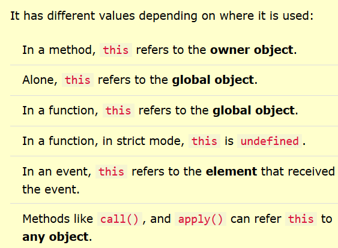

# The `this` Keyword and Dynamic Context in JavaScript

## Introduction

In JavaScript, the `this` keyword is a special identifier that refers to the object on which a function is currently being executed. The value of `this` changes dynamically depending on the context in which the function is called. Understanding the different contexts of `this` is crucial for correctly accessing and manipulating data within functions. 
In this tutorial, we'll explore the various contexts of the `this` keyword and explain what `this` refers to in each context. We'll provide example code snippets with comments to help you grasp the concept more effectively.


## Global Context

In the global context (outside any function), `this` refers to the global object. In web browsers, the global object is the `window` object.

### Example Code Snippet for Global Context

```javascript
console.log(this); // Output: [object Window] (in browser)
```

Explanation: In this example, when `this` is referenced in the global context, it refers to the `window` object (in a browser environment).

## Function Context

In a regular function (not an arrow function), the value of `this` depends on how the function is called.

### Example Code Snippet for Function Context

```javascript
function sayHello() {
  console.log(this);
}

sayHello(); // Output: [object Window] (in browser)
```

Explanation: In this example, when the `sayHello` function is called, `this` refers to the global object (`window` in a browser).

## Method Context

In the context of a method (a function that is a property of an object), `this` refers to the object that the method is called on.

### Example Code Snippet for Method Context

```javascript
const person = {
  name: "Alice",
  sayHello: function () {
    console.log(`Hello, my name is ${this.name}`);
  },
};

person.sayHello(); // Output: Hello, my name is Alice
```

Explanation: In this example, `person` has a method `sayHello`. When `person.sayHello()` is called, `this` inside the `sayHello` method refers to the `person` object, so it can access the `name` property of the object and output "Hello, my name is Alice".

## Constructor Context

In the context of a constructor function (a function used with the `new` keyword to create objects), `this` refers to the newly created object.

### Example Code Snippet for Constructor Context

```javascript
function Person(name) {
  this.name = name;
}

const alice = new Person("Alice");
console.log(alice.name); // Output: Alice
```

Explanation: In this example, `Person` is a constructor function used to create `Person` objects. When `new Person("Alice")` is called, a new object is created, and `this` inside the `Person` function refers to the newly created object. The `name` property is added to the new object with the value "Alice".

## Event Context

In the context of event handlers (functions assigned to events), `this` often refers to the element that triggered the event.

### Example Code Snippet for Event Context

```html
<!DOCTYPE html>
<html>
<body>
  <button onclick="showMessage()">Click Me</button>
  <script>
    function showMessage() {
      console.log(this); // Output: [object HTMLButtonElement]
    }
  </script>
</body>
</html>
```

Explanation: In this example, when the "Click Me" button is clicked, the `showMessage` function is called, and `this` inside the function refers to the button element that triggered the event.

## Arrow Function Context

In an arrow function, `this` is lexically scoped, which means it captures the `this` value from its surrounding context (the context in which the arrow function is defined).

### Example Code Snippet for Arrow Function Context

```javascript
const person = {
  name: "Alice",
  sayHello: function () {
    const greet = () => {
      console.log(`Hello, my name is ${this.name}`);
    };
    greet();
  },
};

person.sayHello(); // Output: Hello, my name is Alice
```

Explanation: In this example, `person` has a method `sayHello`, which contains an arrow function `greet`. When `person.sayHello()` is called, the arrow function `greet` captures the `this` value from the surrounding context (`person`), so `this` inside `greet` refers to the `person` object.

## Summary

In this tutorial, we explored the various contexts of the `this` keyword in JavaScript. `this` dynamically refers to different objects based on how and where a function is called. 
In the global context, `this` refers to the global object. In a regular function, `this` refers to the global object as well. 
In a method context, `this` refers to the object on which the method is called. In a constructor context, `this` refers to the newly created object. 
In an event context, `this` often refers to the element that triggered the event. 
In an arrow function, `this` is lexically scoped and captures the `this` value from its surrounding context. 

Understanding the various contexts of `this` is essential for writing JavaScript code that behaves as expected and for correctly accessing data within functions. Happy coding!