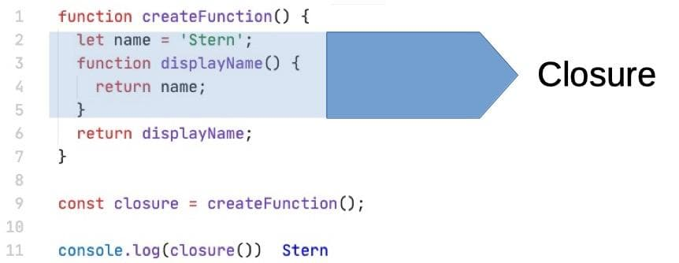

# Closures in JavaScript - A Detailed Tutorial

## Introduction to Closures

Closures are a powerful and often misunderstood concept in JavaScript. They are a fundamental aspect of the language and play a crucial role in many advanced programming techniques. In simple terms, a closure is a function that has access to variables from its outer (enclosing) scope even after the outer function has finished executing.



## Definition of Closures

A closure is a function that remembers and has access to the variables from its containing (enclosing) function's scope even after the containing function has finished executing.

## Syntax of Closures

To create a closure, you need to define a function inside another function and return it. Here's the basic syntax of a closure in JavaScript:

```javascript
function outerFunction() {
  // Outer scope variables
  const outerVariable = 'I am from the outer scope!';

  function innerFunction() {
    // Inner function has access to the outer scope variables
    console.log(outerVariable);
  }

  // Return the inner function
  return innerFunction;
}

// Create a closure by calling the outer function
const closure = outerFunction();

// Now, use the closure to access the outer scope variable
closure(); // Output: "I am from the outer scope!"
```


## Advantages of Closures

Closures offer several advantages in JavaScript:

1. **Encapsulation**: Closures allow you to encapsulate data and behavior within a function, preventing external access. This helps in avoiding conflicts with other parts of the code.

2. **Data Privacy**: Since variables from the outer scope are accessible only through the closure, they cannot be directly modified from outside the function, providing a level of data privacy and security.

3. **Partial Application**: Closures enable the creation of functions with pre-set arguments, which is useful for partial application and currying.

4. **Callbacks and Event Handling**: Closures are commonly used for callbacks and event handling, where they maintain access to the surrounding context even when the event is triggered at a later time.

5. **Module Pattern**: Closures are a fundamental building block for implementing the Module Pattern in JavaScript, allowing you to create private and public members.

## Use Cases of Closures with Real-Time Examples

Let's explore some practical scenarios where closures prove to be extremely useful:

1. **Counter Function**: Create a function that generates a counter, which can be incremented or decremented. The counter value is hidden from external modification.

```javascript
function createCounter() {
  let count = 0;

  function increment() {
    count++;
    console.log(count);
  }

  function decrement() {
    count--;
    console.log(count);
  }

  return {
    increment,
    decrement,
  };
}

const counter = createCounter();
counter.increment(); // Output: 1
counter.increment(); // Output: 2
counter.decrement(); // Output: 1
```

2. **Private Variables**: Implement a function that returns an object with methods to manipulate a private variable.

```javascript
function createPerson(name) {
  let privateName = name;

  return {
    getName: function() {
      return privateName;
    },
    setName: function(newName) {
      privateName = newName;
    },
  };
}

const person = createPerson('John');
console.log(person.getName()); // Output: "John"
person.setName('Alice');
console.log(person.getName()); // Output: "Alice"
```

3. **Event Handling**: Create a function that adds event listeners and remembers a count.

```javascript
function createButtonCounter() {
  let count = 0;

  function handleClick() {
    count++;
    console.log(`Button clicked ${count} times`);
  }

  const button = document.getElementById('myButton');
  button.addEventListener('click', handleClick);
}

createButtonCounter();
```

In this example, the `handleClick` function retains access to the `count` variable even after `createButtonCounter` has finished executing. Each time the button is clicked, it logs the number of clicks.

## Summary

Closures are a fundamental concept in JavaScript, providing a powerful way to manage scope, encapsulate data, and create efficient and reusable code. Understanding closures will not only make you a better JavaScript developer but also open up new possibilities in your code design and architecture.
