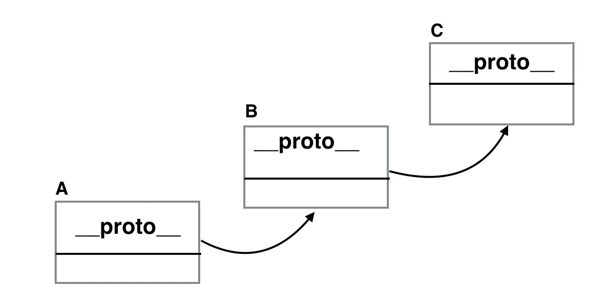

# All About Prototypes in JavaScript

## Introduction to Prototypes

In JavaScript, prototypes play a crucial role in the object-oriented nature of the language. Understanding prototypes is essential for mastering JavaScript's object model and inheritance. A prototype is an object that other objects can inherit properties and methods from. In this tutorial, we will explore prototypes in detail and learn about prototype chaining and prototypal inheritance.


## Definition
**Definition:** In JavaScript, a prototype is like a blueprint or a template for creating objects. It acts as a reference that other objects can look up to find properties and methods they need.

In JavaScript, every function and object has a property named prototype by default. For example,

```
function Person () {
    this.name = 'John',
    this.age = 23
}

const person = new Person();

// checking the prototype value
console.log(Person.prototype); // { ... }
```


In the above example, we are trying to access the prototype property of a `Person` constructor function.

Since the prototype property has no value at the moment, it shows an empty object { ... }.

___

## Prototype Inheritance

In JavaScript, a prototype can be used to add properties and methods to a constructor function. And objects inherit properties and methods from a prototype. For example,

```
// constructor function
function Person () {
    this.name = 'John',
    this.age = 23
}

// creating objects
const person1 = new Person();
const person2 = new Person();

// adding property to constructor function
Person.prototype.gender = 'male';

// prototype value of Person
console.log(Person.prototype);

// inheriting the property from prototype
console.log(person1.gender);
console.log(person2.gender);
```


**Output**

```
{ gender: "male" }
male
male
```

In the above program, we have added a new property `gender` to the `Person` constructor function using:

```
Person.prototype.gender = 'male';
```

Then object `person1` and `person2` inherits the property `gender` from the prototype property of `Person` constructor function.

Hence, both objects `person1` and `person2` can access the gender property.

**Note:** The syntax to add the property to an object constructor function is:

```
objectConstructorName.prototype.key = 'value';
```

Prototype is used to provide additional property to all the objects created from a constructor function.

___

### Add Methods to a Constructor Function Using Prototype

You can also add new methods to a constructor function using prototype. For example,

```
// constructor function
function Person () {
    this.name = 'John',
    this.age = 23
}

// creating objects
const person1 = new Person();
const person2 = new Person();

// adding a method to the constructor function
Person.prototype.greet = function() {
    console.log('hello' + ' ' +  this.name);
}

person1.greet(); // hello John
person2.greet(); // hello John
```


In the above program, a new method `greet` is added to the `Person` constructor function using a prototype.

___

## Changing Prototype

If a prototype value is changed, then all the new objects will have the changed property value. All the previously created objects will have the previous value. For example,

```
// constructor function
function Person() {
    this.name = 'John'
}

// add a property
Person.prototype.age = 20;

// creating an object
const person1 = new Person();

console.log(person1.age); // 20

// changing the property value of prototype
Person.prototype = { age: 50 }

// creating new object
const person3 = new Person();

console.log(person3.age); // 50
console.log(person1.age); // 20
```


**Note**: You should not modify the prototypes of standard JavaScript built-in objects like strings, arrays, etc. It is considered a bad practice.

___

## JavaScript Prototype Chaining



If an object tries to access the same property that is in the constructor function and the prototype object, the object takes the property from the constructor function. For example,

```
function Person() {
    this.name = 'John'
}

// adding property 
Person.prototype.name = 'Peter';
Person.prototype.age = 23

const person1 = new Person();

console.log(person1.name); // John
console.log(person1.age); // 23
```


In the above program, a property name is declared in the constructor function and also in the prototype property of the constructor function.

When the program executes, `person1.name` looks in the constructor function to see if there is a property named `name`. Since the constructor function has the name property with value `'John'`, the object takes value from that property.

When the program executes, `person1.age` looks in the constructor function to see if there is a property named `age`. Since the constructor function doesn't have `age` property, the program looks into the prototype object of the constructor function and the object inherits property from the prototype object (if available).

___

**Note**: You can also access the prototype property of a constructor function from an object.

```
function Person () {
    this.name = 'John'
}

// adding a prototype
Person.prototype.age = 24;

// creating object
const person = new Person();

// accessing prototype property
console.log(person.__proto__);   // { age: 24 }
```

In the above example, a `person` object is used to access the prototype property using `__proto__`. However, `__proto__` has been deprecated and you should avoid using it.