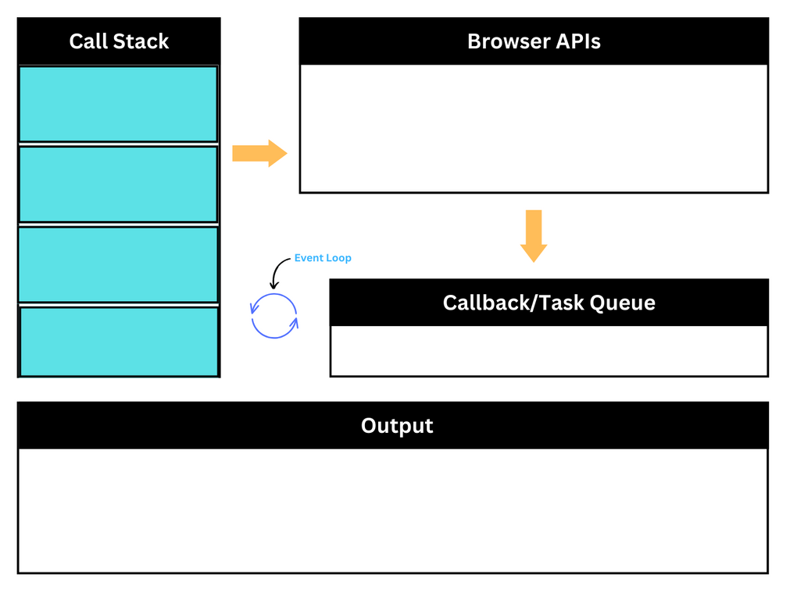
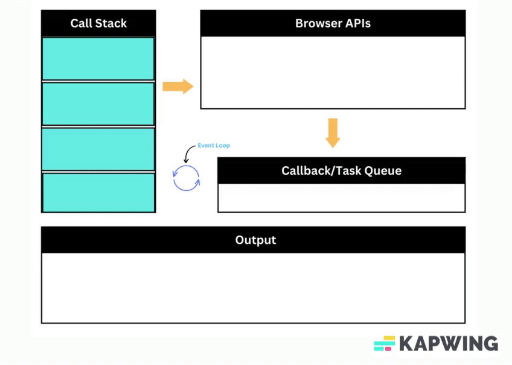

**How Asynchronous Programming Works in JavaScript**

**Introduction to Asynchronous Programming:**

In JavaScript, asynchronous programming is a way to execute code without blocking the main thread. It allows tasks to run independently, making it possible to perform time-consuming operations, such as network requests or file reading, without freezing the entire application. Asynchronous programming is crucial for building responsive web applications and handling tasks that may take some time to complete.




**Components of Asynchronous Programming:**

Several components work together to achieve asynchronous execution in JavaScript:

1. **Call Stack:** The call stack is a data structure that keeps track of the function calls in the code. When a function is called, its entry is added to the top of the call stack. When a function completes its execution, its entry is removed from the stack. This mechanism ensures that functions execute in the correct order.

2. **Event Loop:** The event loop continuously checks the call stack and callback queue for pending tasks. If the call stack is empty, it takes the first task from the callback queue and pushes it to the call stack for execution.

3. **Callback Queue:** The callback queue is a queue that stores callback functions. Callback functions are used in asynchronous programming to handle the results of time-consuming operations. When an asynchronous task completes, its callback function is placed in the callback queue.

4. **Web APIs:** Web APIs are provided by the browser and allow asynchronous operations, such as making network requests, reading files, and setting timers, to be executed outside the main thread. Examples of Web APIs include `setTimeout`, `fetch`, and `XMLHttpRequest`.

**How Asynchronous Programming Works Step by Step:**



1. **Synchronous Code Execution:** When JavaScript starts executing, it processes the code line by line synchronously. Each function call is added to the call stack, and when a function completes its execution, it is removed from the stack.

2. **Encountering an Asynchronous Task:** When the JavaScript engine encounters an asynchronous task, like a network request or a timer, it delegates the task to the browser's Web API, which runs the task in the background, independently of the main thread.

3. **Callback Registration:** After initiating the asynchronous task, the JavaScript engine continues executing the remaining code without waiting for the task to complete. When the task is done, it places the corresponding callback function in the callback queue.

4. **Event Loop and Callback Execution:** The event loop continuously checks the call stack. If the call stack is empty (meaning all synchronous code has been executed), it takes the first function from the callback queue and pushes it onto the call stack for execution.

5. **Asynchronous Code Execution:** The callback function, now on top of the call stack, is executed. It handles the result of the asynchronous task, updating the UI, making further calculations, or performing any other required action.

6. **Repeat the Process:** The event loop keeps checking for pending tasks in the callback queue. This process continues as long as there are tasks waiting to be executed.

**Sample Code Example:**

Let's demonstrate asynchronous programming using a simple example with `setTimeout`, which simulates a delayed operation:

```javascript
console.log("Start");

setTimeout(() => {
  console.log("Timeout callback");
}, 2000);

console.log("End");
```

**Flow Explanation:**

1. The code starts executing, and `"Start"` is logged to the console.
2. The `setTimeout` function is encountered, and it's delegated to the Web API for a 2-second delay.
3. `"End"` is logged to the console.
4. The synchronous code execution is complete, and the JavaScript engine checks the callback queue during the idle time.
5. After 2 seconds, the callback function is placed in the callback queue.
6. The event loop checks the call stack, finds it empty, and takes the callback function from the callback queue.
7. The callback function (`() => { console.log("Timeout callback"); }`) is executed, and `"Timeout callback"` is logged to the console.

**Output:**

```
Start
End
Timeout callback
```

In this example, the `"Start"` and `"End"` log statements are executed synchronously, while the `"Timeout callback"` log statement is executed asynchronously after a 2-second delay. This demonstrates how asynchronous programming works in JavaScript, allowing certain tasks to run independently and not block the main thread.