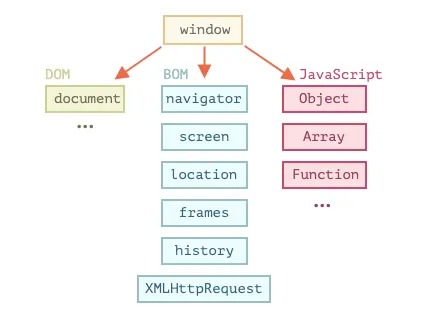

# DOM (Document Object Model) and BOM (Browser Object Model) in JavaScript: A Comprehensive Guide

## Introduction

DOM (Document Object Model) and BOM (Browser Object Model) are two essential concepts in JavaScript that allow developers to interact with web pages and control the browser environment. Understanding DOM and BOM is crucial for web development, as they form the foundation for creating dynamic and interactive web applications. In this tutorial, we will explore the definitions and explanations of DOM and BOM, list common functions of DOM and BOM, provide example code snippets with comments, explain when to use them, and use simple words to explain the concepts.



## DOM (Document Object Model)

### Definition and Explanation

DOM is a programming interface provided by the browser that allows web developers to access and manipulate the structure and content of an HTML or XML document. It represents the document as a tree of objects, where each element, attribute, and text node is represented as an object with properties and methods. The DOM provides a structured way to traverse and modify the document, enabling dynamic and interactive web pages.

### Example Code Snippet

```html
<!DOCTYPE html>
<html>
<head>
  <title>DOM Example</title>
</head>
<body>
  <div id="container">
    <p>Hello, <span id="name">John</span>!</p>
  </div>

  <script>
    // Accessing DOM elements
    const containerElement = document.getElementById("container");
    const nameElement = document.getElementById("name");

    // Modifying text content
    nameElement.textContent = "Jane";

    // Creating a new element
    const newElement = document.createElement("p");
    newElement.textContent = "This is a new paragraph.";
    containerElement.appendChild(newElement);

    // Removing an element
    containerElement.removeChild(nameElement);
  </script>
</body>
</html>
```

### Common Functions of DOM

1. `document.getElementById(id)`: Returns the element with the specified `id`.
2. `document.getElementsByClassName(className)`: Returns a collection of elements with the specified class name.
3. `document.getElementsByTagName(tagName)`: Returns a collection of elements with the specified tag name.
4. `element.innerHTML`: Gets or sets the HTML content of an element.
5. `element.textContent`: Gets or sets the text content of an element.
6. `element.setAttribute(name, value)`: Sets the value of the specified attribute on an element.
7. `element.getAttribute(name)`: Returns the value of the specified attribute on an element.
8. `element.addEventListener(event, callback)`: Adds an event listener to an element.
9. `element.removeChild(child)`: Removes a child element from its parent.
10. `document.createElement(tagName)`: Creates a new element with the specified tag name.

### When to Use DOM

Use DOM when you need to:

1. Access and modify the content and structure of an HTML document dynamically.
2. Traverse the DOM tree to find specific elements or perform actions based on their relationships.
3. Create new elements and add them to the document on the fly.
4. Remove elements or modify their attributes and text content.

DOM is crucial for creating interactive and dynamic web pages. It allows you to manipulate the content and appearance of the document in response to user actions or application logic.

## BOM (Browser Object Model)

### Definition and Explanation

The BOM is a set of objects provided by the browser that allows web developers to interact with the browser window and its features. Unlike the DOM, which deals with the document's structure and content, the BOM deals with browser-related functionalities that are outside the scope of the document. It includes objects like `window`, `navigator`, `screen`, `location`, `history`, etc.

### Example Code Snippet

```html
<!DOCTYPE html>
<html>
<head>
  <title>BOM Example</title>
</head>
<body>
  <button onclick="openNewWindow()">Open New Window</button>

  <script>
    // Opening a new window
    function openNewWindow() {
      window.open("https://www.example.com", "_blank");
    }
  </script>
</body>
</html>
```

### Common Functions of BOM

1. `window.open(url, target)`: Opens a new browser window or tab with the specified URL.
2. `window.close()`: Closes the current browser window.
3. `window.alert(message)`: Displays an alert dialog box with the specified message.
4. `window.prompt(message, defaultText)`: Displays a prompt dialog box with the specified message and a default input text.
5. `window.confirm(message)`: Displays a confirmation dialog box with the specified message and OK/Cancel buttons.
6. `window.setTimeout(callback, delay)`: Executes a function after a specified delay.
7. `window.scrollTo(x, y)`: Scrolls the document to the specified coordinates.

### When to Use BOM

Use BOM when you need to:

1. Interact with the browser window, such as opening or closing new windows or tabs.
2. Display alert, prompt, or confirmation dialog boxes for user interactions.
3. Control browser navigation and history, such as moving forward or backward in the browsing history.
4. Set timers for delayed execution of functions.
5. Scroll the document to specific coordinates.

The BOM allows you to interact with the browser window and provide additional functionality to enhance user experience and control browser behavior.

## Summary

DOM (Document Object Model) and BOM (Browser Object Model) are two fundamental concepts in JavaScript that enable web developers to interact with web pages and control the browser environment. DOM provides a structured way to access and manipulate the content and structure of an HTML or XML document, allowing dynamic and interactive web pages. On the other hand, BOM provides objects and methods to interact with the browser window and its features, allowing control over the browser environment.

By understanding DOM and BOM and using their functions effectively, you can create dynamic, interactive, and feature-rich web applications that provide a seamless user experience across different browsers and devices. Happy coding!