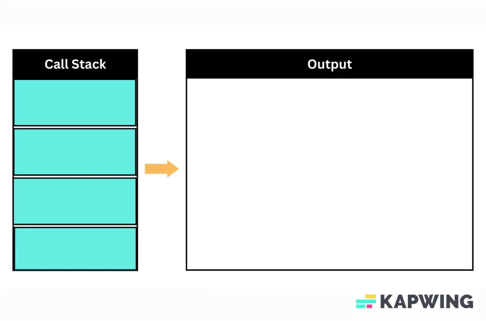

# Understanding Memory Leaks in JavaScript
## Introduction

Memory leaks in JavaScript occur when a program unintentionally retains memory that is no longer needed, leading to an increase in memory usage over time. If not addressed, memory leaks can cause web applications to slow down or crash due to excessive memory consumption. In this tutorial, we will explore memory leaks in JavaScript, provide example code snippets with comments, and explain various ways to avoid memory leaks using simple language.




## Memory Leaks: Definition and Syntax

Memory leaks occur when objects or data that are no longer in use are still being held in memory, preventing the JavaScript engine from garbage collecting them. Here's a common scenario that can lead to a memory leak:

```javascript
// Creating a global variable that retains a reference to an object
let data = {};

// Function that sets data to null, but the reference is still retained in the global variable
function clearData() {
  data = null;
}
```

In this example, `data` is a global variable that holds a reference to an empty object. When the `clearData` function is called and sets `data` to null, the object is no longer accessible. However, since the global variable `data` still exists, the object is not garbage collected, leading to a memory leak.

## Avoiding Memory Leaks

Memory leaks can be avoided by adopting good programming practices and being mindful of how memory is used and released. Below are some ways to prevent memory leaks in JavaScript:

### 1. Use `let` or `const` Instead of `var`

Avoid using `var` to declare variables, as it has function scope and can lead to unintentional global variables. Instead, use `let` or `const` to declare variables with block scope.

```javascript
// Bad - var creates a global variable
var x = 10;

// Good - let has block scope
let y = 20;

// Good - const for constants
const z = 30;
```

### 2. Avoid Global Variables

Limit the use of global variables and prefer encapsulating data within functions and modules to avoid accidentally retaining references.

```javascript
// Bad - global variable can lead to memory leaks
let globalData = [];

function addToGlobalData(item) {
  globalData.push(item);
}
```

### 3. Release Event Listeners

When adding event listeners, always remember to remove them when they are no longer needed, especially when the element is removed from the DOM.

```html
<!DOCTYPE html>
<html>
<head>
  <title>Memory Leak Example</title>
</head>
<body>
  <button id="clickButton">Click Me</button>

  <script>
    const buttonElement = document.getElementById("clickButton");

    function onClick() {
      console.log("Button clicked!");
    }

    // Add event listener
    buttonElement.addEventListener("click", onClick);

    // Remove event listener when it's no longer needed
    function cleanup() {
      buttonElement.removeEventListener("click", onClick);
    }
  </script>
</body>
</html>
```

### 4. Use Closures Wisely

Be careful with closures, as they can retain references to variables even after their scope has ended. Make sure to release any unnecessary closures or variables when they are no longer needed.

```javascript
function createClosure() {
  let data = "Sensitive Data";

  // Closure retains reference to 'data' even after createClosure() has finished executing
  return function() {
    console.log(data);
  };
}
```

### 5. Clear Timers and Intervals

Always clear timers and intervals when they are no longer needed to prevent the associated functions from being retained in memory.

```javascript
function startTimer() {
  const intervalId = setInterval(() => {
    console.log("Timer is running.");
  }, 1000);

  // Clear the interval when it's no longer needed
  function stopTimer() {
    clearInterval(intervalId);
  }
}
```

### 6. Release DOM References

When removing elements from the DOM, make sure to release any references to them, as DOM elements can also cause memory leaks.

```javascript
const element = document.getElementById("myElement");

// Removing the element from the DOM
element.parentNode.removeChild(element);

// Release reference to the element
element = null;
```

## Summary

Memory leaks in JavaScript can be a common problem if not addressed properly. By understanding the causes of memory leaks and adopting best practices like avoiding global variables, releasing event listeners and closures, and clearing timers and intervals, you can significantly reduce the risk of memory leaks in your web applications. Being mindful of how memory is used and released will lead to more efficient and stable applications. Happy coding!

# Garbage Collection in JavaScript: A Comprehensive Guide

## Introduction

Garbage collection is a fundamental concept in JavaScript that deals with memory management. In JavaScript, memory is allocated dynamically to store objects and data, but it is essential to free up memory when objects are no longer in use to prevent memory leaks and optimize performance. Garbage collection is the process of identifying and reclaiming unused memory, making it available for future allocations. In this tutorial, we will explore garbage collection in JavaScript, explain how it works, and provide a simple code snippet with comments to demonstrate the process.

## Garbage Collection: How It Works

In JavaScript, memory is managed automatically by the JavaScript engine. When you create objects or variables, the engine allocates memory to store them. However, when these objects or variables are no longer accessible or in use, they become eligible for garbage collection.

The garbage collection process involves several steps:

1. **Marking Phase**: The garbage collector starts by identifying all the objects that are still in use and reachable from the root of the application. The root refers to global variables, local variables in the current function call stack, and variables referenced by closures.

2. **Tracing References**: Once the root objects are marked, the garbage collector follows all the references from these root objects to other objects, marking them as well. This process continues recursively until all reachable objects are marked.

3. **Sweeping Phase**: After marking all reachable objects, the garbage collector proceeds to sweep through the memory, identifying all the objects that are not marked (i.e., not reachable). These objects are considered garbage and are eligible for removal.

4. **Memory Reclamation**: In the final step, the garbage collector frees the memory occupied by the objects marked as garbage, making it available for future allocations.

By regularly performing garbage collection, the JavaScript engine ensures that memory is efficiently managed, and unused objects do not accumulate over time, causing memory leaks.

## Example Code Snippet

Let's consider a simple code snippet to demonstrate garbage collection in JavaScript:

```javascript
function createObjects() {
  // Create two objects
  const obj1 = {};
  const obj2 = {};

  // Reference obj2 from obj1
  obj1.ref = obj2;

  // Reference obj1 from the global scope
  window.obj = obj1;

  // obj1 and obj2 are no longer in use after this function returns
}

function simulateMemoryConsumption() {
  // Create a large array to simulate memory consumption
  const array = new Array(1000000).fill(0);

  // The array is no longer in use after this function returns
}

createObjects();
simulateMemoryConsumption();

// Garbage collection will occur after this point
```

In the code above, we have two functions: `createObjects` and `simulateMemoryConsumption`. In the `createObjects` function, we create two objects (`obj1` and `obj2`) and reference `obj2` from `obj1`. Additionally, we reference `obj1` from the global scope (`window.obj`). After the `createObjects` function returns, both `obj1` and `obj2` are no longer in use, as there are no references to them.

In the `simulateMemoryConsumption` function, we create a large array (`array`) to simulate memory consumption. However, after this function returns, the `array` is no longer in use.

After the execution of the entire code, garbage collection will occur. The garbage collector will identify that `obj1`, `obj2`, and the `array` are no longer reachable from the root of the application. As a result, they are marked as garbage and will be removed from memory during the sweeping phase, reclaiming the memory they occupied.

## Summary

Garbage collection is a crucial process in JavaScript that ensures efficient memory management. By automatically identifying and reclaiming memory occupied by objects that are no longer in use, garbage collection prevents memory leaks and optimizes the performance of JavaScript applications. Understanding how garbage collection works helps developers write memory-efficient code and build robust web applications. Happy coding!