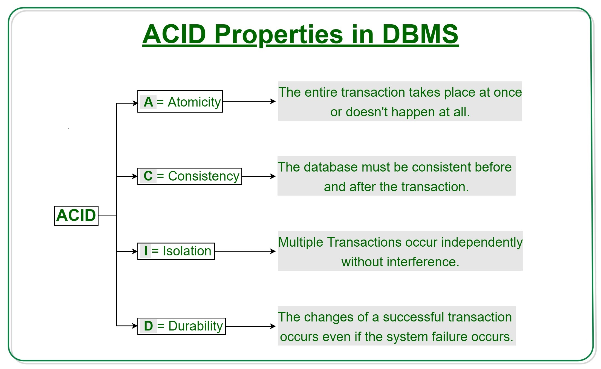

# Understanding ACID Properties in DBMS: Ensuring Data Integrity and Reliability

In the realm of Database Management Systems (DBMS), ACID properties play a crucial role in maintaining the integrity and reliability of data. In this tutorial, we'll delve deep into the world of ACID properties, exploring what they are and why they are essential for designing robust and dependable databases.



## What are ACID Properties?

ACID stands for **Atomicity**, **Consistency**, **Isolation**, and **Durability**. These properties represent a set of characteristics that ensure the reliability of transactions within a database. Let's break down each property:

### 1. Atomicity

**Atomicity** guarantees that a transaction is treated as a single, indivisible unit. Either all the changes within a transaction are committed, or none of them are. This property prevents partial or incomplete updates to the database.

### 2. Consistency

**Consistency** ensures that a transaction takes the database from one consistent state to another. In other words, a transaction should bring the database from one valid state to another valid state, maintaining data integrity and adhering to defined constraints.

### 3. Isolation

**Isolation** ensures that transactions can occur concurrently without interfering with each other. Even though multiple transactions may be executed simultaneously, the end result should be the same as if they were executed sequentially. Isolation prevents "dirty reads" and "phantom reads."

### 4. Durability

**Durability** guarantees that once a transaction is committed, its effects are permanent and will survive any subsequent system failures. Committed data will not be lost, even in the face of power outages, crashes, or other disruptions.

## The Importance of ACID Properties

ACID properties are essential for maintaining data integrity, reliability, and consistency in a DBMS. Let's understand their significance:

- **Data Integrity:** ACID properties ensure that the data remains accurate and consistent, even in the presence of errors or failures.

- **Reliability:** By enforcing the atomicity, consistency, isolation, and durability of transactions, ACID properties provide a strong foundation for dependable and trustworthy systems.

- **Multi-User Environments:** ACID properties enable multiple users to work simultaneously without causing data conflicts or inconsistencies.

- **Financial Transactions:** In applications like banking systems, where precision and correctness are critical, ACID properties prevent incorrect updates and ensure the accuracy of account balances.

## ACID in Practice

Let's illustrate the ACID properties with a simple example using SQL statements and a hypothetical banking scenario.

```sql
-- Example of Atomicity and Consistency
BEGIN;
UPDATE Accounts SET Balance = Balance - 100 WHERE AccountNumber = 'A123';
UPDATE Accounts SET Balance = Balance + 100 WHERE AccountNumber = 'B456';
COMMIT;
```

```sql
-- Example of Isolation
-- Transaction 1
BEGIN;
SELECT Balance FROM Accounts WHERE AccountNumber = 'A123';
-- Transaction 2 (concurrent)
BEGIN;
UPDATE Accounts SET Balance = Balance + 50 WHERE AccountNumber = 'A123';
COMMIT; -- Transaction 2 completes
-- Transaction 1 continues
SELECT Balance FROM Accounts WHERE AccountNumber = 'A123'; -- Isolation prevents seeing uncommitted changes from Transaction 2
COMMIT; -- Transaction 1 completes
```

```sql
-- Example of Durability
-- After COMMIT, the changes are durable
```

## Summary

ACID properties are the bedrock of reliable and robust databases. They ensure data integrity, consistency, and reliability, making them indispensable for applications where accuracy and correctness are paramount. By understanding and applying the principles of ACID, you're equipped to design and build databases that can withstand failures, maintain data accuracy, and provide a dependable foundation for applications of all kinds.