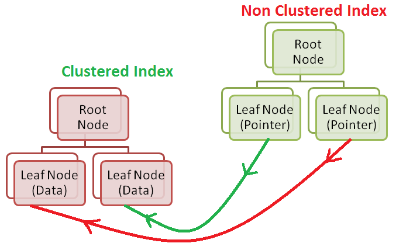

# Indexing in DBMS: A Comprehensive Tutorial

## Introduction to Indexing in DBMS

**Indexing** is a fundamental concept in database management systems (DBMS). It's a technique that significantly improves the efficiency of data retrieval operations by providing a fast and efficient way to locate specific rows within a database table. In this comprehensive tutorial, we'll explore what indexing is, why it's essential, how it works, types of indexes, and best practices for using indexing in a DBMS.

## What is Indexing?

In a DBMS, an **index** is a data structure that enhances the speed of data retrieval operations on a database table at the cost of additional storage space and maintenance overhead. Indexes are akin to the index of a book, which allows you to quickly locate information in the book without having to read every page sequentially.

## Why is Indexing Important?

1. **Improved Query Performance:** Indexes make data retrieval operations significantly faster, especially when dealing with large datasets. Without indexes, the database engine would have to scan the entire table, which can be inefficient and time-consuming.

2. **Faster Sorting:** Indexes facilitate quick sorting of data based on the indexed columns. This is especially important for operations like ordering query results.

3. **Enforcement of Uniqueness:** Indexes can enforce uniqueness constraints, ensuring that data in a column (or combination of columns) is unique across the table.

4. **Optimized Joins:** When performing joins between multiple tables, indexes on the join columns improve join performance dramatically.

## How Indexing Works

Indexing works by creating a separate data structure that stores a subset of the table's columns and their corresponding row identifiers. These row identifiers typically point to the actual rows in the table.

When you execute a query that involves a column with an index, the database engine consults the index rather than scanning the entire table. This leads to a substantial reduction in the number of disk I/O operations and a significant improvement in query speed.

## Types of Indexes

There are several types of indexes in DBMS, each suited to specific use cases. Some common types include:

1. **Single-Column Index:** This index is created on a single column. It's the most basic type of index and is used when queries predominantly involve that column.

2. **Composite Index (Multi-Column Index):** This index involves multiple columns and is used when queries involve combinations of those columns. The order of columns in a composite index matters; it affects how efficiently the index is used for various queries.

3. **Unique Index:** A unique index enforces uniqueness constraints on one or more columns, ensuring that no two rows in the indexed columns have the same values.

4. **Clustered Index:** In databases that support clustered indexes (e.g., SQL Server), the data rows themselves are stored in the order defined by the index. Each table can have only one clustered index.

5. **Non-Clustered Index:** These indexes are separate from the actual data rows and contain a pointer to the data rows. A table can have multiple non-clustered indexes.

6. **Full-Text Index:** Used for text-based searching, full-text indexes allow you to perform text searches efficiently. They are common in search engines and document management systems.

# Clustered Index and Non-Clustered Index in DBMS: A Comprehensive Guide

In Database Management Systems (DBMS), indexes are essential for efficient data retrieval. Two common types of indexes are Clustered Indexes and Non-Clustered Indexes. In this tutorial, we will explore what these indexes are, how they work, and their differences.

## Clustered Index

A Clustered Index determines the physical order of data rows in a table. Each table can have only one Clustered Index, and the data rows are stored on disk in the same order as the index. This means that the order of rows in the table matches the order of the index.

### Characteristics of a Clustered Index:

- **Defines Physical Order**: It defines the physical order of rows in the table, so the table itself is essentially an ordered list based on the Clustered Index key.

- **Unique**: A Clustered Index key is unique, meaning it ensures that each row in the table has a unique value for the indexed column(s).

- **Faster Retrieval**: Retrieving data based on the Clustered Index key is very fast because it utilizes the physical order of rows.

- **Storage Impact**: It may impact storage space as data rows are stored in the order of the Clustered Index.

- **One Per Table**: There can be only one Clustered Index per table.

## Non-Clustered Index

A Non-Clustered Index is a separate data structure that contains a copy of selected columns of the table, along with a pointer to the corresponding data row. Unlike the Clustered Index, a table can have multiple Non-Clustered Indexes.

### Characteristics of a Non-Clustered Index:

- **Doesn't Define Physical Order**: It does not affect the physical order of rows in the table. The data rows remain in their storage order.

- **Non-Unique**: Non-Clustered Index keys do not have to be unique, meaning multiple rows may have the same key value.

- **Faster Data Retrieval**: Retrieving data based on Non-Clustered Index key(s) is faster than a full table scan but slower than using a Clustered Index.

- **Storage Impact**: Non-Clustered Indexes require additional storage space to store the indexed columns and pointers.

- **Multiple Indexes**: A table can have multiple Non-Clustered Indexes.

## When to Use Clustered and Non-Clustered Indexes

- **Clustered Index**:
  - Use when you want to physically store data rows in a specific order.
  - Typically used on columns with unique or semi-unique values (e.g., primary keys).
  - There can be only one Clustered Index per table.

- **Non-Clustered Index**:
  - Use when you want to improve data retrieval speed based on specific columns.
  - Suitable for columns that are frequently used in search and filtering operations.
  - Multiple Non-Clustered Indexes can be created on a table.

## Best Practices for Using Indexing

1. **Identify the Right Columns:** Choose columns for indexing based on the types of queries your application will execute frequently. Indexing every column is not always the best strategy, as it can increase storage requirements and slow down data modification operations.

2. **Use Composite Indexes Wisely:** When creating composite indexes, consider the order of columns. Place columns that are frequently used in filtering conditions first.

3. **Monitor Index Usage:** Regularly monitor the performance of your indexes to identify unused or redundant indexes. Removing unnecessary indexes can improve data modification operations.

4. **Regular Maintenance:** Indexes can become fragmented over time due to data modifications. Schedule regular index maintenance tasks to rebuild or reorganize indexes.

5. **Consider Database Design:** Properly designed database schemas can reduce the need for excessive indexing. Normalize your data, use appropriate data types, and avoid duplicate data.

6. **Test Query Performance:** Before implementing indexes, test query performance with and without indexes to ensure that they are indeed improving performance.

7. **Plan for Growth:** Consider the expected growth of your database. Indexing strategies that work well for small datasets may not be suitable for large datasets.

## Summary

Indexing is a vital technique in DBMS that enhances query performance, sorting, and data retrieval operations. By understanding the types of indexes, best practices for their use, and their impact on database performance, you can effectively design and manage indexes to optimize the performance of your database-driven applications.