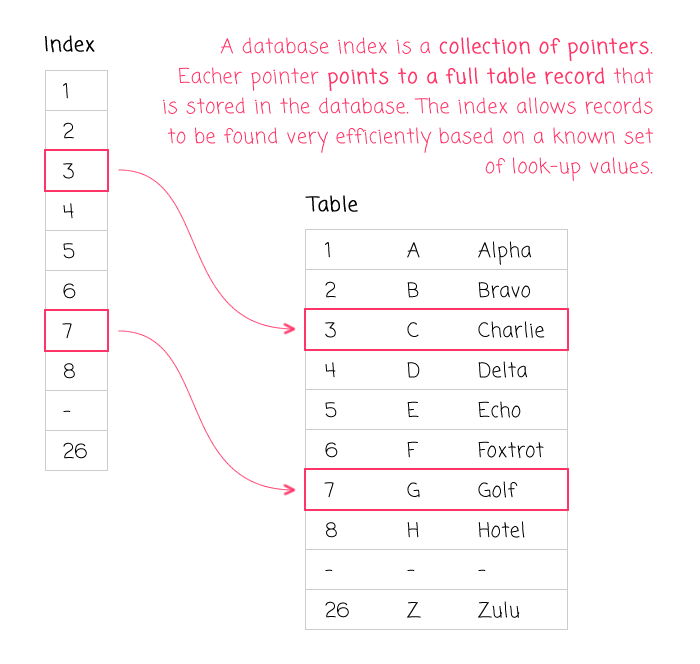

# Indexing in MySQL: A Comprehensive Tutorial

Indexes in MySQL are essential database objects that significantly enhance the speed and efficiency of data retrieval operations. They provide a way to quickly locate specific rows within database tables. In this tutorial, we'll explore indexes in MySQL, including types of indexes, their purposes, and provide sample syntax and examples.


## Types of Indexes in MySQL

Here are some common types of indexes in MySQL:

 **Index**: A regular index that speeds up data retrieval operations but allows duplicate values.

 **Unique Index**: Ensures that the indexed columns have unique values across rows.

 **Primary Key Index**: Ensures uniqueness and is used to identify each row uniquely.

 **Full-Text Index**: Used for text-based searching in full-text columns.


## Index with Purpose, Syntax, and Example


## Indexing Syntax

### CREATE INDEX Statement

The `CREATE INDEX` statement is used to create a non-unique index on one or more columns of a table. Non-unique indexes allow duplicate values.

**Syntax**:
```sql
CREATE INDEX index_name
ON table_name (column1, column2, ...);
```

**Example**:
```sql
-- Create a non-unique index on the 'LastName' column of the 'Employees' table
CREATE INDEX idx_last_name
ON Employees (LastName);
```
### Primary Key Index

**Purpose**: To ensure uniqueness and identify each row uniquely.

**Syntax**:
```sql
CREATE TABLE table_name (
    column1 data_type PRIMARY KEY,
    column2 data_type,
    ...
);
```

**Example**:
```sql
-- Create a table with a primary key index on 'EmployeeID'
CREATE TABLE Employees (
    EmployeeID INT PRIMARY KEY,
    FirstName VARCHAR(50),
    LastName VARCHAR(50),
    Department VARCHAR(50)
);
```

### Unique Index

**Purpose**: To ensure that the indexed columns have unique values across rows.

**Syntax**:
```sql
CREATE TABLE table_name (
    column1 data_type UNIQUE,
    column2 data_type,
    ...
);
```

**Example**:
```sql
-- Create a table with a unique index on 'Email'
CREATE TABLE Users (
    UserID INT,
    Email VARCHAR(100) UNIQUE,
    ...
);
```


## Composite Indexes

### Creating Indexes on Multiple Columns

A composite index is created on two or more columns of a table. It is useful when queries involve combinations of those columns.

**Syntax**:
```sql
CREATE INDEX index_name
ON table_name (column1, column2, ...);
```

**Example**:
```sql
-- Create a composite index on the 'LastName' and 'Department' columns of the 'Employees' table
CREATE INDEX idx_last_name_department
ON Employees (LastName, Department);
```

### Understanding the Order of Columns in Composite Indexes

The order of columns in a composite index matters. The index is most efficient when queried using the same order of columns defined in the index.

**Example**:
```sql
-- Create a composite index on 'Department' and 'LastName' (different order)
CREATE INDEX idx_department_last_name
ON Employees (Department, LastName);
```

Queries that filter by 'Department' and 'LastName' in this order will benefit from this index. However, queries filtering by 'LastName' alone may not utilize this index optimally.

### Use Cases for Composite Indexes

Composite indexes are useful in scenarios where you frequently query on multiple columns together, such as:

- Filtering by multiple criteria (e.g., 'Department' and 'LastName').
- Sorting data by multiple columns.
- Performing efficient joins between tables on multiple columns.

## Indexing Best Practices

### Choosing the Right Columns to Index

- Identify columns frequently used in WHERE clauses, JOIN conditions, or ORDER BY clauses.
- Avoid over-indexing by considering the trade-off between read and write performance.
- Prioritize indexing on columns with high cardinality (few distinct values) for better selectivity.

### Balancing Between Read and Write Operations

- Remember that indexing improves read performance but can slow down write (insert, update, delete) operations.
- Evaluate the workload of your application and database to strike a balance between read and write efficiency.

### Monitoring and Optimizing Indexes

- Regularly monitor index usage and performance using tools like `EXPLAIN` and MySQL query profiling.
- Rebuild or reorganize indexes to eliminate fragmentation and maintain performance.
- Consider using covering indexes for queries that retrieve specific columns to avoid unnecessary data retrieval.

By following these indexing syntax guidelines and best practices, you can effectively create and manage indexes in MySQL databases to optimize data retrieval performance while maintaining a balance with write operations.