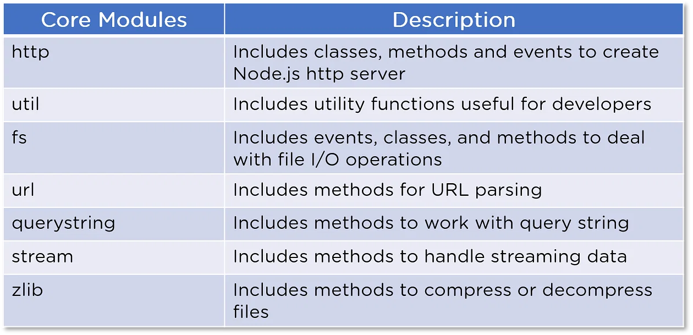

# Node.js Modules: A Comprehensive Guide

Node.js modules are a fundamental aspect of building scalable and maintainable applications in Node.js. They allow you to organize your code into reusable components, making it easier to manage and maintain your Node.js applications. In this tutorial, we will explore what Node.js modules are, their types (core modules and custom modules), and how to use them.

## What are Node.js Modules?

Node.js modules are encapsulated blocks of code that can be reused across different parts of your application. They help you break down your application into smaller, manageable pieces, making it easier to develop, maintain, and collaborate on projects. Modules also promote code reusability and separation of concerns.

### Core Modules

Node.js provides a set of built-in modules, known as core modules, which are available for use without the need for installation or additional setup. These modules cover a wide range of functionality, from file system operations to networking and more. Here is a list of some common core modules and their brief explanations:




- **`fs` (File System)**: Provides methods for interacting with the file system, including reading and writing files.
  
- **`http` (HTTP)**: Enables you to create HTTP servers and clients for building web applications.
  
- **`https` (HTTPS)**: Similar to the `http` module but for secure HTTPS connections.
  
- **`path` (Path)**: Helps with working with file and directory paths, making it platform-independent.
  
- **`os` (Operating System)**: Allows you to access information about the operating system on which Node.js is running.
  
- **`util` (Utilities)**: Provides utility functions for common tasks, like inheritance and debugging.
  
- **`events` (Events)**: Offers an event-driven programming framework, allowing you to create and handle custom events.
  
- **`stream` (Streams)**: Provides a powerful API for working with streams of data.
  
- **`crypto` (Cryptography)**: Offers cryptographic functionality for hashing, encryption, and decryption.
  
- **`url` (URL)**: Helps with URL parsing and formatting.
  
- **`querystring` (Query String)**: Parses and formats query strings commonly used in URLs.
  
- **`zlib` (Zlib)**: Allows you to compress and decompress data using the zlib compression library.
  
- **`buffer` (Buffer)**: Provides a way to work with binary data directly.
  
- **`child_process` (Child Processes)**: Allows you to create and interact with child processes for running external commands.

These core modules come with Node.js, so you can use them in your applications without installing any additional packages.

### Custom Modules

In addition to core modules, you can create your own custom modules in Node.js. Custom modules are reusable pieces of code that you create to encapsulate specific functionality. Here's how to create a custom module and use it in your Node.js application:

#### Example: Creating and Using a Custom Module

Let's say you want to create a custom module that calculates the area of a rectangle.

1. **Create a JavaScript file for your module** (e.g., `rectangle.js`):

   ```javascript
   // rectangle.js
   exports.calculateArea = (length, width) => {
     return length * width;
   };
   ```

2. **Use the custom module in your main application**:

   ```javascript
   const rectangleModule = require('./rectangle');

   const length = 5;
   const width = 10;

   const area = rectangleModule.calculateArea(length, width);

   console.log(`The area of the rectangle is: ${area}`);
   ```

   In this example, we created a custom module named `rectangle.js` that exports a `calculateArea` function. In our main application, we import the module using `require` and use the exported function to calculate the area.

## Summary

Node.js modules, whether core or custom, play a vital role in structuring and organizing your code. They facilitate code reusability, separation of concerns, and collaboration among developers. Understanding how to use core modules and create custom modules is essential for building scalable and maintainable Node.js applications.