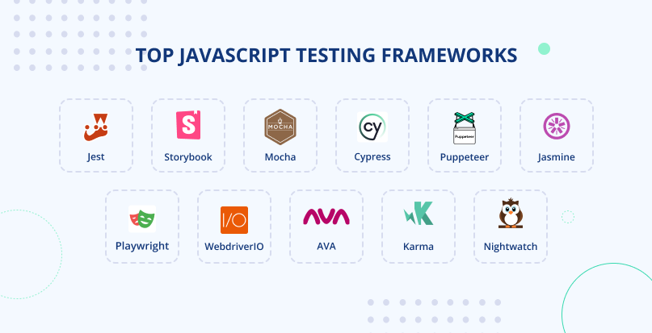

# Unit Testing in Node.js: A Comprehensive Guide

## What is Unit Testing?

**Unit testing** is a software testing technique where individual units or components of a software application are tested in isolation to ensure they perform as expected. In unit testing, a "unit" typically refers to the smallest testable part of the code, such as a function, method, or class. The primary goal of unit testing is to validate that each unit of code behaves correctly in isolation, regardless of the rest of the application's functionality.

### Advantages of Unit Testing

1. **Early Detection of Bugs**: Unit tests can catch bugs and issues at an early stage of development, making them easier and cheaper to fix.

2. **Improved Code Quality**: Writing unit tests encourages modular and well-structured code, leading to higher code quality and maintainability.

3. **Documentation**: Unit tests serve as living documentation that describes how each unit of code is intended to work.

4. **Refactoring Confidence**: Unit tests provide confidence that code changes and refactoring won't introduce regressions or break existing functionality.

5. **Support for Agile Development**: Unit testing aligns well with agile development practices, allowing for rapid iterations and continuous integration.

6. **Isolation of Defects**: If a unit test fails, it narrows down the scope of the issue, making it easier to identify and fix the problem.

## Unit Testing Frameworks in Node.js

Node.js offers several unit testing frameworks that simplify the process of writing and executing unit tests. Here are some popular options:

### 1. **Mocha**:

- Mocha is a flexible and widely-used testing framework for Node.js.
- It supports various assertion libraries, including Chai and Should.
- Mocha allows you to use different test runners like `describe` and `it` to structure your tests.

### 2. **Jest**:

- Jest is a zero-config testing framework often associated with React, but it's versatile and suitable for Node.js projects as well.
- Jest includes built-in assertion and mocking libraries.
- It offers features like parallel test execution and snapshot testing.

### 3. **Jasmine**:

- Jasmine is an easy-to-learn testing framework with a BDD (Behavior-Driven Development) style.
- It provides a clean syntax for writing tests and assertions.
- Jasmine has built-in spies for function tracking and mocking.

### 4. **AVA**:

- AVA is known for its parallel test execution, which speeds up the testing process.
- It has a simple and concise syntax for writing tests.
- AVA focuses on minimal configuration and easy setup.

### 5. **Jest vs. Mocha vs. Jasmine**:

- Jest, Mocha, and Jasmine are among the most popular choices for Node.js testing.
- Jest is a good choice for beginners, as it comes with many features out of the box.
- Mocha offers flexibility, allowing you to choose your assertion library and test runner.
- Jasmine provides a BDD-style syntax and is a great fit for those familiar with BDD principles.

Here are the official documentation links for the mentioned Node.js unit testing frameworks:

1. **Mocha**:
   - Documentation: [Mocha Official Documentation](https://mochajs.org/)
   - GitHub Repository: [Mocha GitHub Repository](https://github.com/mochajs/mocha)

2. **Jest**:
   - Documentation: [Jest Official Documentation](https://jestjs.io/)
   - GitHub Repository: [Jest GitHub Repository](https://github.com/facebook/jest)

3. **Jasmine**:
   - Documentation: [Jasmine Official Documentation](https://jasmine.github.io/)
   - GitHub Repository: [Jasmine GitHub Repository](https://github.com/jasmine/jasmine)

4. **AVA**:
   - Documentation: [AVA Official Documentation](https://github.com/avajs/ava)
   - GitHub Repository: [AVA GitHub Repository](https://github.com/avajs/ava)

## Summary

Unit testing is a crucial practice in software development that helps ensure code correctness, maintainability, and reliability. With the right unit testing framework in Node.js, you can easily create and run tests for your codebase. By writing and maintaining unit tests, you can confidently develop, refactor, and enhance your applications while catching issues early in the development process.