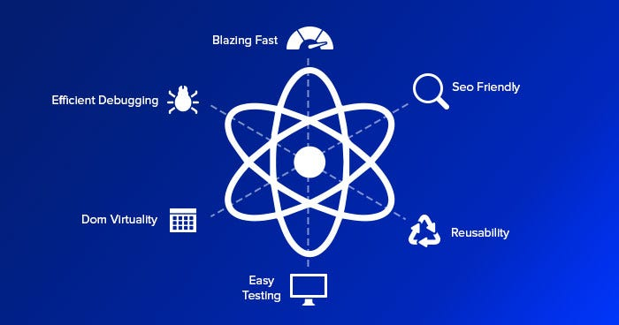

# Tutorial: Why React? Advantages of React: Virtual DOM & Components

Welcome to the tutorial on why React is an essential library for building modern web applications. React is a JavaScript library that focuses on creating user interfaces (UIs) with a component-based approach. In this tutorial, we will explore the key features and advantages of using React for your web development projects.

## 1. Introduction to React

React, developed and maintained by Facebook, is an open-source JavaScript library used for building user interfaces. It allows developers to create reusable UI components and manage the state of these components efficiently. React follows the concept of a Virtual DOM (Document Object Model), which enhances performance by minimizing direct manipulation of the actual DOM.

## 2. Component-Based Architecture

One of the main reasons to choose React is its component-based architecture. With React, you can break down your UI into smaller, reusable components. This modular approach improves code organization, encourages reusability, and simplifies maintenance.

## 3. Virtual DOM

React's Virtual DOM is a representation of the actual DOM in memory. When the state of a component changes, React creates a new Virtual DOM, compares it with the previous one, and calculates the minimal set of changes needed to update the actual DOM. This approach reduces unnecessary reflows and repaints, leading to improved performance.

## 4. JSX - Declarative UI

React uses JSX (JavaScript XML) to describe the structure of UI components. JSX provides a syntax that closely resembles HTML, making it intuitive for developers to write UI code. This declarative approach simplifies the process of building and maintaining complex UIs.

## 5. Unidirectional Data Flow

React follows a unidirectional data flow, also known as the "one-way data binding." Data flows in a single direction, from parent components to child components. This structure makes it easier to understand how data changes affect the UI and simplifies debugging.

## 6. Reusable Components

React encourages the creation of reusable UI components. These components can be used across different parts of your application, reducing redundancy and improving development speed. Reusable components also lead to consistent UI design and behavior.

## 7. Virtual DOM Diffing

React's Virtual DOM diffing algorithm is a powerful optimization technique. By calculating the difference between the current and previous Virtual DOM states, React minimizes the number of updates required on the actual DOM. This results in improved application performance and a smoother user experience.

## 8. Rich Ecosystem

React has a vibrant ecosystem with a wide range of libraries, tools, and extensions. From state management solutions like Redux and MobX to UI component libraries like Material-UI and Ant Design, React offers a variety of options to enhance your development process.

## 9. Strong Community and Resources

The React community is large and active, providing a wealth of resources such as documentation, tutorials, and forums. This community support makes it easier to find solutions to common problems and stay updated with the latest trends in React development.

## 10. Cross-Platform Development

With React Native, a framework built on top of React, you can use your React skills to develop native mobile applications for iOS and Android. This enables code reuse and accelerates the development of cross-platform apps.

---

## Summary: Why Choose React?

- Component-Based Architecture: Break down UI into reusable components.
- Virtual DOM: Efficiently update the UI with minimal DOM manipulation.
- JSX - Declarative UI: Write UI code that resembles HTML for easy understanding.
- Unidirectional Data Flow: Simplify data management and debugging.
- Reusable Components: Develop consistent UI design and behavior.
- Virtual DOM Diffing: Optimize performance by minimizing DOM updates.
- Rich Ecosystem: Access a variety of libraries and tools for enhanced development.
- Strong Community and Resources: Find support and stay updated with the community.
- Cross-Platform Development: Use React Native for native mobile app development.

By choosing React, you're equipping yourself with a powerful tool to build modern, efficient, and scalable web applications.

Remember that React might not be the best choice for every project, but understanding its features and benefits will help you make informed decisions about when and where to use it in your development journey. Happy coding!