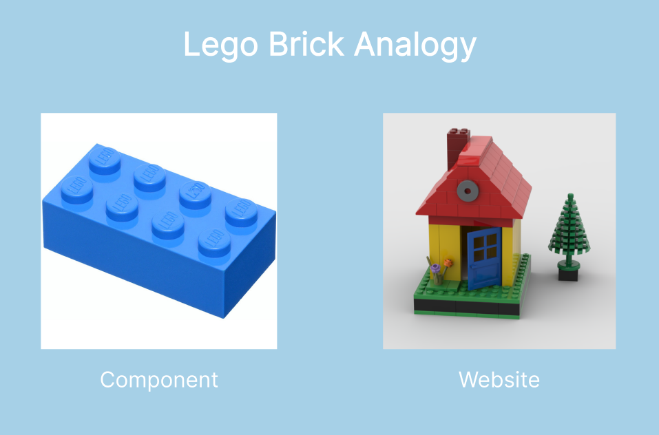

# Tutorial: Introduction to ReactJS Components

Welcome to the tutorial on ReactJS components. In this tutorial, we will introduce you to the concept of components in ReactJS, explain how they work, and provide a hands-on example of creating and using components.

## What is a Component?

In simple terms, a component in ReactJS is like a building block for your user interface. Just as you might assemble a complex structure using Lego bricks, React components allow you to create complex user interfaces by combining smaller, reusable parts.



In Layman's terms, think of a component as a self-contained piece of a web page that can do something specific, like displaying a button, a header, or a list.


## Sample Demo Component Code

Let's start with a simple example to display an Avenger using a React component:

```jsx
import React from 'react';

function Avenger() {
  return (
    <div>
      <h2>Avenger: Iron Man</h2>
      <p>Tony Stark, a genius, billionaire, playboy, and philanthropist.</p>
    </div>
  );
}

export default Avenger;
```

In this code, we've defined a functional component named `Avenger`. It returns JSX that represents the content of an Avenger card.

## Using Multiple Components

React allows you to create multiple components and compose them to build your application. Here's an example of how you might use the `Avenger` component within another component or App:

```jsx
import React from 'react';
import Avenger from './Avenger';

function App() {
  return (
    <div>
      <h1>Marvel Universe</h1>
      <Avenger />
    </div>
  );
}

export default App;
```

In this example, the `App` component renders an `Avenger` component along with a title. This demonstrates how components can be reused and combined to build more complex UIs.

## Summary:

- React components are building blocks for user interfaces.
- They allow you to create self-contained and reusable parts of a web page.
- Components can represent anything from buttons to entire sections of a page.
- Components help in code organization, reusability, and maintainability.
- You can create components using functional or class-based syntax.
- Components can be composed and combined to create complex UI structures.

Remember that mastering the concept of components is essential for developing scalable and maintainable applications using ReactJS.

## Official Documentation Resources:

1. [React Official Documentation](https://reactjs.org/docs/getting-started.html)
2. [React Components and Props](https://reactjs.org/docs/components-and-props.html)