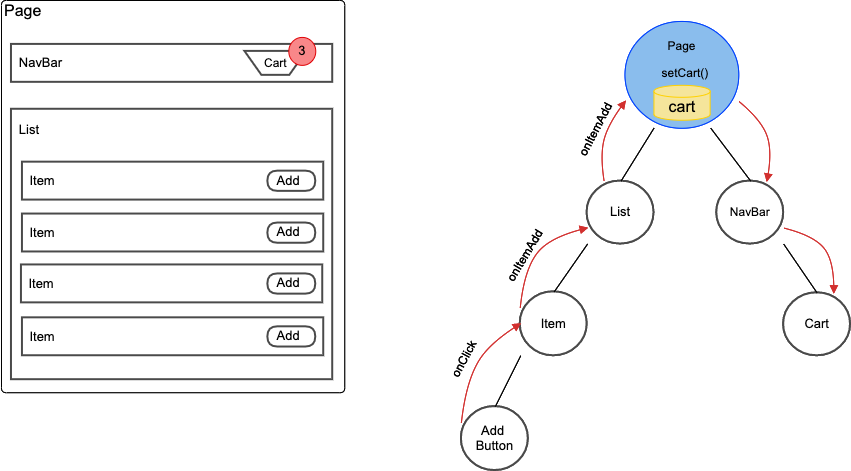
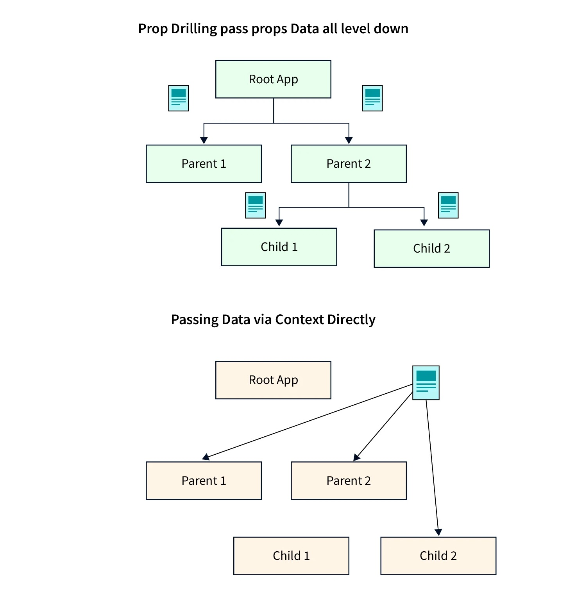

## Prop Drilling in React: Understanding and Mitigating the Issue

Prop drilling is a common challenge that arises when passing data through multiple layers of components in a React application. This phenomenon can lead to inefficiencies and make code harder to maintain. In this tutorial, we'll dive deep into prop drilling, understand its implications, and explore strategies to mitigate its impact.

### What is Prop Drilling?

**Prop drilling**, also known as **component nesting**, occurs when data needs to be passed from a top-level component down to a deeply nested component. Each intermediary component in the hierarchy must receive the data as props and pass it along to the next level, even if those components don't directly use the data.



### The Problem with Prop Drilling

Prop drilling can lead to several issues:

- **Complexity:** As the application grows, prop drilling can lead to overly complex and convoluted code, making it difficult to understand and maintain.

- **Performance Impact:** Passing data through multiple layers can affect performance, as it requires re-rendering components even if they don't use the data.

- **Maintenance Challenges:** If the data structure changes, you may need to update multiple components throughout the hierarchy, increasing the chance of introducing bugs.

### Example: Prop Drilling Scenario

Consider a scenario where a user's information needs to be passed down to a deeply nested component:

```jsx
<UserProfileContainer>
  <UserProfile>
    <UserDetails>
      <UserAddress />
    </UserDetails>
  </UserProfile>
</UserProfileContainer>
```

In this example, if `UserAddress` needs the user's information, it must be passed as props through all intermediary components (`UserProfileContainer`, `UserProfile`, and `UserDetails`), even if they don't use the data.

### Mitigating Prop Drilling




To mitigate prop drilling, consider the following strategies:

1. **Context API:** The Context API allows you to pass data through the component tree without explicitly passing it through every component. Context provides a way to share data that can be accessed by any component without prop drilling.

2. **Redux or Mobx:** State management libraries like Redux or Mobx provide a centralized store where data can be stored and accessed from any component, eliminating the need for prop drilling.

3. **Higher-Order Components (HOCs):** Use HOCs to wrap components and inject the required data as props. This can help decouple the components from the hierarchy and reduce the need for direct prop passing.

4. **Render Props:** Utilize the render prop pattern, where a component's functionality is encapsulated in a function that's passed as a prop. This allows you to control what data is exposed to components.

5. **Hooks:** If using functional components, hooks like `useContext` and custom hooks can help manage shared data in a more elegant way.

### Conclusion

Prop drilling can lead to code complexity, performance issues, and maintenance challenges. By understanding the drawbacks of prop drilling and exploring alternatives such as the Context API, state management libraries, HOCs, render props, and hooks, you can significantly improve the maintainability and performance of your React applications. Choose the strategy that best fits your project's requirements to minimize the impact of prop drilling and build more efficient and maintainable code.