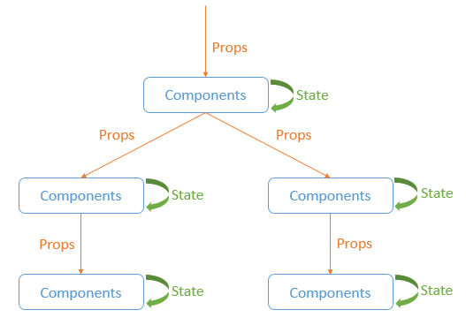

## State vs. Props in React: An In-Depth Comparison

Understanding the differences between **state** and **props** is crucial for building robust and maintainable React applications. These two concepts are fundamental to React's component-based architecture. This tutorial will provide you with an in-depth comparison of state and props, their roles, and when to use each in your React components.



### Introduction to State and Props in React

Both state and props are mechanisms for handling data in React components, but they serve different purposes:

- **State:** Represents mutable data that belongs to a component. It allows components to manage and update their own internal data.

- **Props:** Short for "properties," props are immutable data passed from parent to child components. They allow components to be configured and receive external data.

### State: Managing Internal Data

**State** is used to manage and represent data that can change within a component. It allows components to maintain their own local data that can be modified over time. Changes to state trigger re-rendering, updating the UI based on the new data.

### Example: State Usage

```jsx
import React, { Component } from 'react';

class Counter extends Component {
  constructor(props) {
    super(props);
    this.state = {
      count: 0,
    };
  }

  incrementCount = () => {
    this.setState({ count: this.state.count + 1 });
  };

  render() {
    return (
      <div>
        <p>Count: {this.state.count}</p>
        <button onClick={this.incrementCount}>Increment</button>
      </div>
    );
  }
}

export default Counter;
```

### Props: Passing Data from Parent to Child

**Props** are used to pass data from a parent component to a child component. They provide a way to configure child components and make them more reusable. Props are immutable and cannot be modified by the child component that receives them.

### Example: Props Usage

```jsx
import React from 'react';

function Greeting(props) {
  return <h1>Hello, {props.name}!</h1>;
}

export default Greeting;
```

### Key Differences: State vs. Props

- **Mutability:** State is mutable and can be changed using `setState()`, while props are immutable and cannot be changed by the receiving component.

- **Ownership:** State belongs to the component that defines it, whereas props are passed from a parent component to a child component.

- **Change Triggers:** Changes in state trigger component re-rendering, while changes in props from a parent component also lead to re-rendering of the child component.

summarizing the key differences between **State** and **Props** in React:

| Aspect           | State                                     | Props                                       |
|------------------|-------------------------------------------|---------------------------------------------|
| Ownership        | Belongs to the component that defines it  | Passed from parent to child components     |
| Mutability       | Mutable (can be changed using `setState()`) | Immutable (cannot be modified by the child component) |
| Change Triggers  | Changes trigger component re-rendering    | Changes trigger child component re-rendering |
| Scope            | Local to the component                    | Received and accessed by the child component |
| Source of Truth  | Component itself                          | Parent component                           |
| Usage            | Managing internal data                    | Configuring and customizing child components |
| Example          | Tracking user input, toggling UI elements | Displaying external data or behavior        |


### When to Use Each: State vs. Props

- **Use State When:** You need to manage and update local data within a component. For example, tracking user input, toggling UI elements, or maintaining component-specific data.

- **Use Props When:** You want to pass data from a parent component to a child component. Props are ideal for configuring and customizing child components to display external data or behavior.

### Summary

State and props are essential concepts in React, each serving distinct roles in component-based development. By understanding their differences and use cases, you'll be equipped to make informed decisions about when to use state to manage internal data and when to use props to pass data between components. Utilizing state and props effectively contributes to building modular, maintainable, and highly customizable React applications.