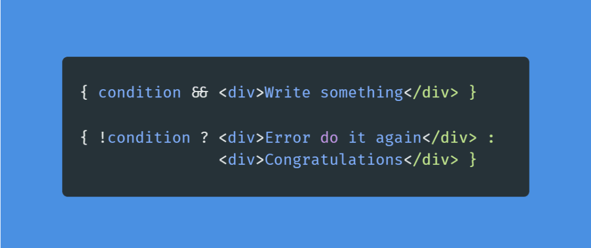

## Conditional Rendering in React: A Comprehensive Guide

Conditional rendering in React is a powerful technique that allows you to control what content is displayed to the user based on certain conditions. This approach enables you to create dynamic and responsive user interfaces by rendering components or elements only when specific conditions are met. This tutorial will provide you with an in-depth understanding of conditional rendering in React.

### Introduction to Conditional Rendering

Conditional rendering is the practice of rendering different components or elements based on the values of certain conditions. It allows you to create more interactive and context-aware user interfaces by showing or hiding content as needed. React provides several ways to implement conditional rendering, each suited for different scenarios.

### Using `if` Statements

The simplest form of conditional rendering involves using standard `if` statements within the `render()` method of a component.

```jsx
import React, { Component } from 'react';

class ConditionalRendering extends Component {
  render() {
    if (this.props.isLoggedIn) {
      return <p>Welcome, user!</p>;
    } else {
      return <p>Please log in to continue.</p>;
    }
  }
}

export default ConditionalRendering;
```

### Using the Ternary Operator

The ternary operator is a concise way to perform conditional rendering.

```jsx
import React from 'react';

function ConditionalRendering(props) {
  return (
    <div>
      {props.isLoggedIn ? <p>Welcome, user!</p> : <p>Please log in to continue.</p>}
    </div>
  );
}

export default ConditionalRendering;
```

### Using `&&` Operator

The `&&` operator can be used to conditionally render content.

```jsx
import React from 'react';

function ConditionalRendering(props) {
  return (
    <div>
      {props.isLoggedIn && <p>Welcome, user!</p>}
    </div>
  );
}

export default ConditionalRendering;
```

### Using `Switch` Statement

For more complex scenarios, a `switch` statement can be used.

```jsx
import React from 'react';

function RoleBasedRendering(props) {
  switch (props.userRole) {
    case 'admin':
      return <p>Welcome, admin user!</p>;
    case 'user':
      return <p>Welcome, regular user!</p>;
    default:
      return <p>Please log in to continue.</p>;
  }
}

export default RoleBasedRendering;
```

### Conditional Rendering with State

You can also use component state to control conditional rendering.

```jsx
import React, { Component } from 'react';

class DynamicRendering extends Component {
  constructor(props) {
    super(props);
    this.state = {
      showContent: false,
    };
  }

  render() {
    return (
      <div>
        <button onClick={() => this.setState({ showContent: true })}>Show Content</button>
        {this.state.showContent && <p>Dynamic content is displayed!</p>}
      </div>
    );
  }
}

export default DynamicRendering;
```

### Conclusion

Conditional rendering is a crucial concept in React that empowers you to create versatile and user-friendly interfaces. By selectively rendering components or elements based on conditions, you can provide tailored experiences to your users. This guide has equipped you with various techniques for implementing conditional rendering in your React applications. Utilize these techniques wisely to build dynamic, responsive, and engaging UIs.