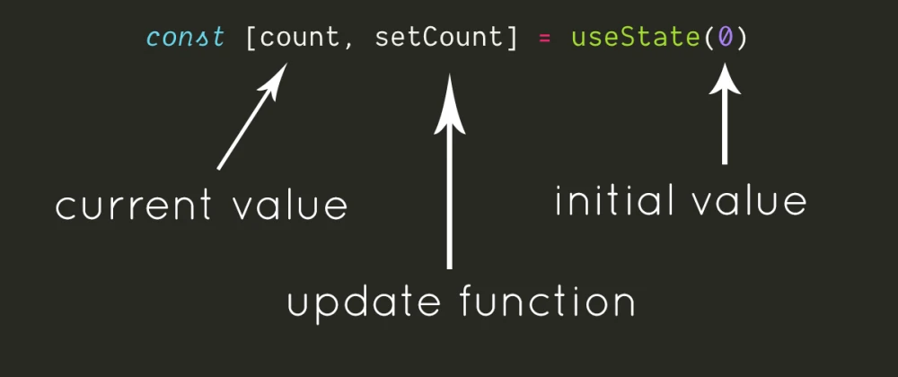

## The useState Hook in React: Managing Component State Simplified

The `useState` hook is a foundational part of React hooks that empowers functional components to manage local state. This tutorial delves into the `useState` hook, explaining its purpose, usage, and benefits through illustrative code examples.

### What is the useState Hook?

In React, components need to manage state to keep track of dynamic data. The `useState` hook provides an elegant solution to this, allowing functional components to introduce and update state without converting them into class components.



### Using the useState Hook

Let's start by exploring how to use the `useState` hook to manage state in a functional component.

```jsx
import React, { useState } from 'react';

function Counter() {
  // Declare a state variable named "count" with an initial value of 0
  const [count, setCount] = useState(0);

  return (
    <div>
      <p>Count: {count}</p>
      {/* Use setCount to update the value of "count" */}
      <button onClick={() => setCount(count + 1)}>Increment</button>
    </div>
  );
}

export default Counter;
```

In this example, the `useState` hook is used to declare a state variable named `count` with an initial value of `0`. The `setCount` function returned by the hook is used to update the value of `count` when the button is clicked.

### Handling Complex State

The `useState` hook can also handle more complex state structures, such as objects or arrays.

```jsx
import React, { useState } from 'react';

function Form() {
  // Declare a state variable named "formData" with an initial object
  const [formData, setFormData] = useState({ username: '', email: '' });

  const handleInputChange = (event) => {
    // Update the specific property of "formData" based on the input's name attribute
    setFormData({
      ...formData,
      [event.target.name]: event.target.value
    });
  };

  return (
    <form>
      <input
        type="text"
        name="username"
        value={formData.username}
        onChange={handleInputChange}
      />
      <input
        type="email"
        name="email"
        value={formData.email}
        onChange={handleInputChange}
      />
    </form>
  );
}

export default Form;
```

In this example, the `formData` state variable is an object that stores the values of username and email inputs. The `setFormData` function is used to update specific properties of the object based on input changes.

### Benefits of useState

- **Functional Components:** `useState` enables functional components to manage state, reducing the need for class components.

- **Code Clarity:** Declaring state variables right where they're used enhances the readability and maintainability of your code.

- **Predictable Updates:** The hook guarantees the correct handling of state updates and re-renders.

### Conclusion

The `useState` hook is a powerful tool that simplifies state management in functional components. By declaring state variables and using the corresponding updater functions, you can easily incorporate dynamic behavior into your components. This tutorial provided an overview of `useState` and showcased how it can be used to manage simple and complex state scenarios. Apply this knowledge to enhance your React components with controlled and dynamic behavior while keeping your codebase concise and comprehensible.