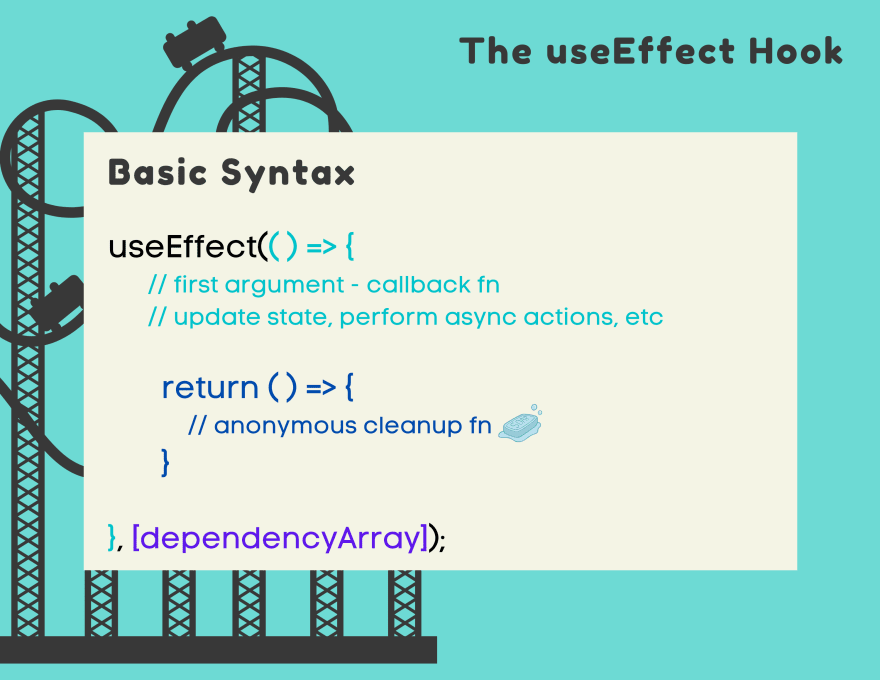

## Mastering the useEffect Hook in React: Managing Side Effects with Ease

The `useEffect` hook is a fundamental piece of React's hooks arsenal, allowing functional components to perform side effects and manage lifecycle behaviors. This comprehensive tutorial takes you through the ins and outs of the `useEffect` hook, its purpose, applications, and usage.

### What is the useEffect Hook?

In React, side effects like data fetching, DOM manipulation, and subscriptions were traditionally handled in class component lifecycle methods. The `useEffect` hook brings this functionality to functional components, streamlining the way side effects are managed.





### Using the useEffect Hook

Let's dive into how to use the `useEffect` hook to manage side effects within a functional component.

```jsx
import React, { useState, useEffect } from 'react';

function DataFetching() {
  // Declare a state variable to hold fetched data
  const [data, setData] = useState([]);

  // Use useEffect to fetch data when the component mounts
  useEffect(() => {
    // Fetch data from an API (e.g., JSONPlaceholder)
    fetch('https://jsonplaceholder.typicode.com/posts')
      .then((response) => response.json())
      .then((data) => setData(data));
  }, []); // Empty dependency array ensures this effect runs only once on mount

  return (
    <div>
      <h1>Fetched Data</h1>
      <ul>
        {data.map((post) => (
          <li key={post.id}>{post.title}</li>
        ))}
      </ul>
    </div>
  );
}

export default DataFetching;
```

In this example, the `useEffect` hook is employed to fetch data from the JSONPlaceholder API when the component mounts. By providing an empty dependency array (`[]`), the effect runs only once after the initial render.

### Managing Cleanup with useEffect

`useEffect` can also handle cleanup tasks, such as unsubscribing from a subscription or clearing timers.

```jsx
import React, { useState, useEffect } from 'react';

function Timer() {
  const [time, setTime] = useState(0);

  useEffect(() => {
    // Start a timer
    const timer = setInterval(() => {
      setTime((prevTime) => prevTime + 1);
    }, 1000);

    // Clean up the timer when the component unmounts
    return () => clearInterval(timer);
  }, []);

  return <div>Time: {time} seconds</div>;
}

export default Timer;
```

In this example, the timer interval is set up within the `useEffect` hook. The cleanup function returned by the effect clears the timer when the component unmounts.

### Benefits of useEffect

- **Lifecycle Logic in Functional Components:** `useEffect` enables functional components to manage lifecycle-related behavior and side effects.

- **Cleanup Handling:** The hook supports cleanup actions when the component unmounts or when dependencies change.

- **Reduced Boilerplate:** `useEffect` streamlines side effect management, reducing the need for separate lifecycle methods.

### Conclusion

The `useEffect` hook revolutionizes the way functional components handle side effects and lifecycle-related behavior. By encapsulating data fetching, subscriptions, timers, and other side effects within functional components, you can create more concise, organized, and maintainable code. This tutorial provided an in-depth exploration of the `useEffect` hook and demonstrated its application through practical examples. Apply this newfound knowledge to efficiently manage side effects and enhance the functionality of your React components.