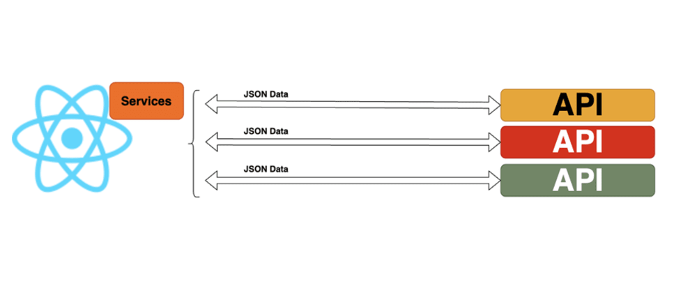

## Navigating the Web: A Comprehensive Guide to Handling HTTP Requests in React

In the world of modern web applications, the ability to communicate with external APIs is crucial. This tutorial serves as your guide to mastering HTTP requests in React, covering the basics, different request methods, error handling, and practical examples using the JSONPlaceholder API.



### Making GET Requests

Making a GET request to an API is one of the most common operations. Let's explore how to fetch data using the `fetch` API and the `axios` library.

#### Using the `fetch` API

```jsx
import React, { useState, useEffect } from 'react';

function FetchExample() {
  const [data, setData] = useState([]);

  useEffect(() => {
    // Fetch data from the JSONPlaceholder API
    fetch('https://jsonplaceholder.typicode.com/posts')
      .then((response) => response.json())
      .then((jsonData) => setData(jsonData))
      .catch((error) => console.error('Error fetching data:', error));
  }, []);

  return (
    <div>
      <h1>Fetch Example</h1>
      <ul>
        {data.map((post) => (
          <li key={post.id}>{post.title}</li>
        ))}
      </ul>
    </div>
  );
}

export default FetchExample;
```

#### Using the `axios` Library

```
npm install axios
```

```jsx
import React, { useState, useEffect } from 'react';
import axios from 'axios';

function AxiosExample() {
  const [data, setData] = useState([]);

  useEffect(() => {
    // Fetch data using axios
    axios
      .get('https://jsonplaceholder.typicode.com/posts')
      .then((response) => setData(response.data))
      .catch((error) => console.error('Error fetching data:', error));
  }, []);

  return (
    <div>
      <h1>Axios Example</h1>
      <ul>
        {data.map((post) => (
          <li key={post.id}>{post.title}</li>
        ))}
      </ul>
    </div>
  );
}

export default AxiosExample;
```

### Making POST Requests

Making a POST request is essential when sending data to an API, such as creating new resources.

```jsx
import React, { useState } from 'react';
import axios from 'axios';

function PostExample() {
  const [postTitle, setPostTitle] = useState('');

  const handlePost = () => {
    // Send a POST request to create a new post
    axios
      .post('https://jsonplaceholder.typicode.com/posts', {
        title: postTitle,
        body: 'Sample body',
        userId: 1,
      })
      .then((response) => console.log('Post created:', response.data))
      .catch((error) => console.error('Error creating post:', error));
  };

  return (
    <div>
      <h1>Post Example</h1>
      <input
        type="text"
        placeholder="Enter post title"
        value={postTitle}
        onChange={(e) => setPostTitle(e.target.value)}
      />
      <button onClick={handlePost}>Create Post</button>
    </div>
  );
}

export default PostExample;
```

### Error Handling

Handling errors is a crucial aspect of HTTP requests to ensure a smooth user experience.

```jsx
import React, { useState, useEffect } from 'react';
import axios from 'axios';

function ErrorHandlingExample() {
  const [data, setData] = useState([]);
  const [error, setError] = useState(null);

  useEffect(() => {
    // Fetch data with error handling
    axios
      .get('https://jsonplaceholder.typicode.com/posts')
      .then((response) => setData(response.data))
      .catch((error) => setError(error));
  }, []);

  if (error) {
    return <div>Error: {error.message}</div>;
  }

  return (
    <div>
      <h1>Error Handling Example</h1>
      <ul>
        {data.map((post) => (
          <li key={post.id}>{post.title}</li>
        ))}
      </ul>
    </div>
  );
}

export default ErrorHandlingExample;
```

### Summary

Handling HTTP requests is a crucial skill for building dynamic and data-driven React applications. This tutorial provided a comprehensive exploration of making GET and POST requests, error handling, and practical examples using the JSONPlaceholder API. By mastering HTTP requests, you can interact with external data sources, create interactive user experiences, and build powerful applications that connect to the world of web APIs.